# Anwendung administrieren

Die Anwendungsverwaltung umfasst alle administrativen Funktionen des DCM. Administrator:innen legen hier Nutzerkonten an, verwalten Rollen und steuern über Arbeitsbereiche und Templates, welche Optionen Datenkurator:innen zum Anlegen und Ausführen von Jobs bereitstehen.

## Nutzer & Rollen verwalten

In der Nutzerverwaltung erstellen Sie als Administrator:in neue Benutzerkonten, passen Rollen an und steuern den Zugang zu Arbeitsbereichen. Auf diese Weise bestimmen Sie, wer welche Jobs anlegen und verwalten kann.

### Nutzer anlegen

Über die Schaltfläche *Nutzer erstellen* öffnen Sie ein Dialogfenster, in dem Sie die erforderlichen Informationen erfassen und Zugriffsrechte vergeben.

!!! info "Passwortvergabe für neue Konten"
    Beim Anlegen eines Benutzerkontos wird noch kein Passwort gesetzt. Über einen erzeugten Aktivierungslink vergibt die Person ihr Passwort eigenständig bei der ersten Anmeldung.

-   **Neuen Nutzer hinzufügen**

    ---

    { .image-frame }

    Über die Schaltfläche *Nutzer erstellen* legen Sie ein neues Benutzerkonto an.

-   **Nutzerdaten erfassen**

    ---

    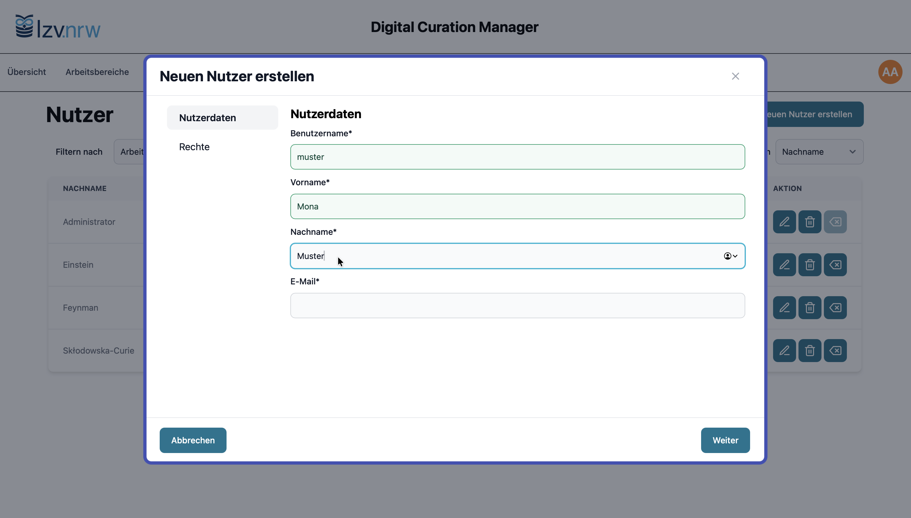{ .image-frame }

    Erfassen Sie zunächst die grundlegenden Nutzerinformationen.

-   **Berechtigungen vergeben**

    ---

    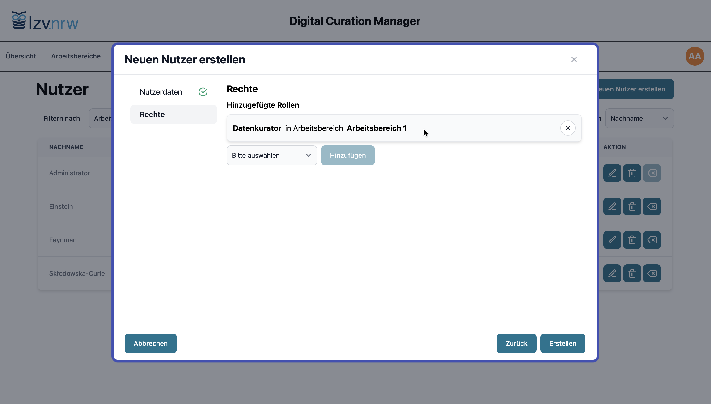{ .image-frame }

    Legen Sie die Rolle des Nutzers fest.  
    Die Zuweisung der Rolle *Datenkurator* kann in einem oder mehreren Arbeitsbereichen erfolgen.

-   **Aktivierungslink**

    ---

    { .image-frame }

    Nach Abschluss des Dialogs erhalten Sie einen Link, über den der Nutzer den Account eigenständig durch Setzen eines Passworts aktivieren kann.

### Nutzereinstellungen ändern

Die Bearbeitung der Nutzereinstellungen erfolgt über die Schaltflächen in der Übersichtstabelle.

- 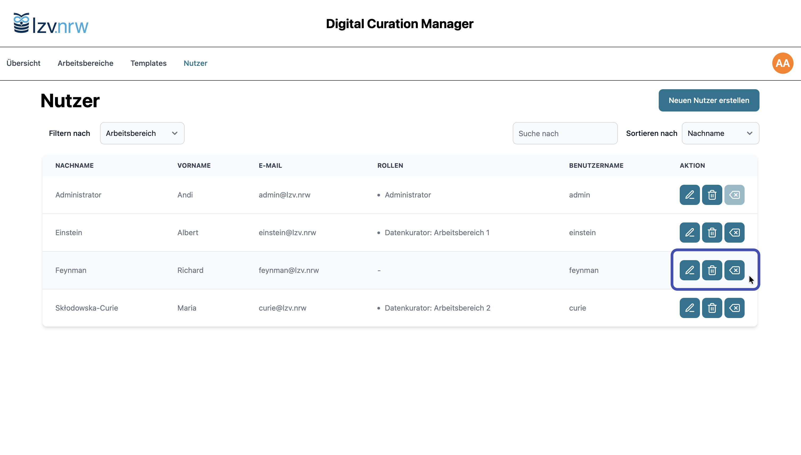{ .image-frame }

Für jeden Account finden Sie rechts die drei Aktionen:  
{ .no-glightbox width="14px" } Nutzerdaten und Berechtigungen bearbeiten 
{ .no-glightbox width="14px" } Nutzer aus dem System entfernen 
{ .no-glightbox width="14px" } Passwort zurücksetzen

*Passwort zurücksetzen* erzeugt einen Aktivierungslink. Darüber kann der Nutzer – wie bei der Erstaktivierung – eigenständig ein neues Passwort vergeben.

## Arbeitsbereiche verwalten

Arbeitsbereiche strukturieren die Anwendung nach Projekten oder Organisationseinheiten.  
Sie legen fest, **welche Templates** Datenkurator:innen zur Verfügung stehen und **in welchem Kontext** sie Jobs erstellen können.

### Arbeitsbereiche anlegen

Benötigen Sie für Ihr Setup unterschiedliche Zuständigkeiten für Quell- und Zielsysteme, legen Sie mehrere Arbeitsbereiche an. Ein einziger Arbeitsbereich genügt, wenn keine weitere Trennung notwendig ist.

-   **Arbeitsbereich erstellen**

    ---

    { .image-frame }

    Über die Schaltfläche *Arbeitsbereich erstellen* legen Sie einen neuen Arbeitsbereich an.

-   **Titel vergeben**

    ---

    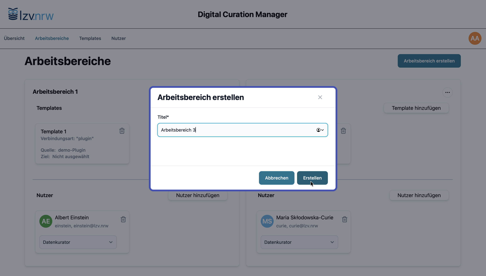{ .image-frame }

    Vergeben Sie einen Titel, der den Arbeitsbereich eindeutig beschreibt.

#### Templates zuweisen

Templates können einem Arbeitsbereich auf der jeweiligen Karte direkt zugewiesen werden, um Datenkurator:innen die Konfiguration von Jobs auf Basis dieser Templates zu ermöglichen.

!!! tip "Zuordnung von Templates zu einem Arbeitsbereich"
    Ein Template lässt sich lediglich einem Arbeitsbereich zuweisen. Um ein existierendes Template einem anderen Arbeitsbereich zuzuweisen, entfernen Sie es zunächst aus dem alten Arbeitsbereich.

-   **Template hinzufügen**

    ---

    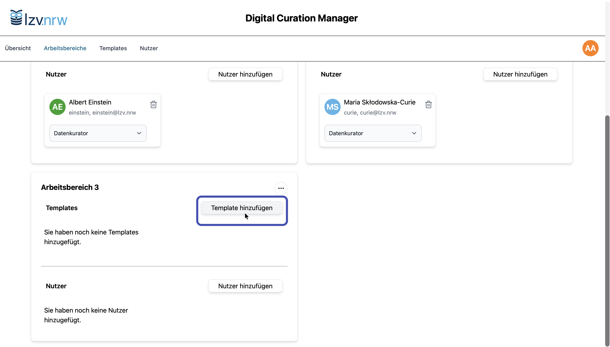{ .image-frame }

    Klicken Sie auf die Schaltfläche *Template hinzufügen* auf der Karte des jeweiligen Arbeitsbereichs.

-   **Template auswählen**

    ---

    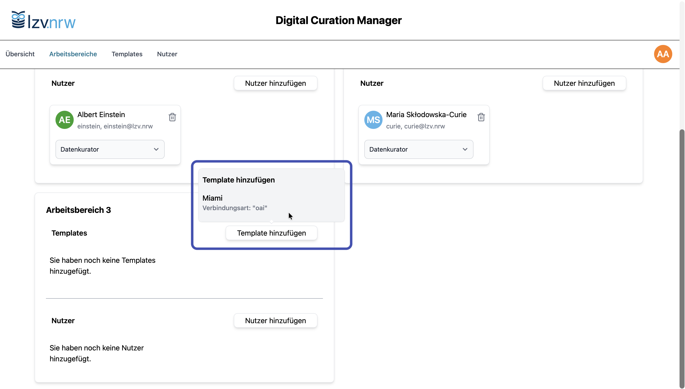{ .image-frame }

    Im sich aufklappenden Menü stehen ihnen die freien Templates zur Auswahl zur Verfügung.

-   **Template entfernen**

    ---

    ![Über das Löschen-Symbol <svg stroke="currentColor" fill="none" stroke-width="2" viewBox="0 0 24 24" stroke-linecap="round" stroke-linejoin="round" height="20" width="20" xmlns="http://www.w3.org/2000/svg"><polyline points="3 6 5 6 21 6"></polyline><path d="M19 6v14a2 2 0 0 1-2 2H7a2 2 0 0 1-2-2V6m3 0V4a2 2 0 0 1 2-2h4a2 2 0 0 1 2 2v2"></path><line x1="10" y1="11" x2="10" y2="17"></line><line x1="14" y1="11" x2="14" y2="17"></line></svg> lässt sich die Zuweisung von Templates zu Arbeitsbereichen aufheben.](assets/images/screenshots/admin/arbeitsbereiche/arbeitsbereich-template-entfernen.png){ .image-frame }

    Über das *Löschen-Symbol* <svg stroke="currentColor" fill="none" stroke-width="2" viewBox="0 0 24 24" stroke-linecap="round" stroke-linejoin="round" height="20" width="20" xmlns="http://www.w3.org/2000/svg"><polyline points="3 6 5 6 21 6"></polyline><path d="M19 6v14a2 2 0 0 1-2 2H7a2 2 0 0 1-2-2V6m3 0V4a2 2 0 0 1 2-2h4a2 2 0 0 1 2 2v2"></path><line x1="10" y1="11" x2="10" y2="17"></line><line x1="14" y1="11" x2="14" y2="17"></line></svg> lässt sich die Zuweisung von Templates zu Arbeitsbereichen aufheben.

#### Nutzer zuweisen

Arbeitsbereichen können ein oder mehrere Nutzer zugewiesen werden.

-   **Nutzer hinzufügen**

    ---

    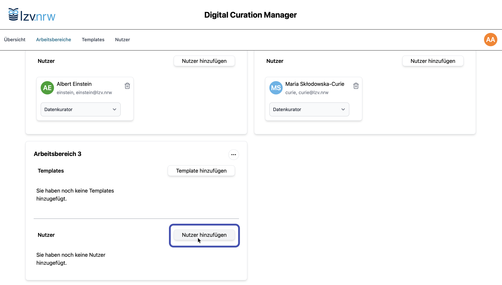{ .image-frame }

    Mit einem Klick auf Nutzer hinzufügen können Sie einen neuen Nutzer zu dem Arbeitsbereich hinzufügen und ihm damit Zugriff auf die verknüpften Templates (und die darauf basierenden Jobs) gewähren.

-   **Nutzer auswählen**

    ---

    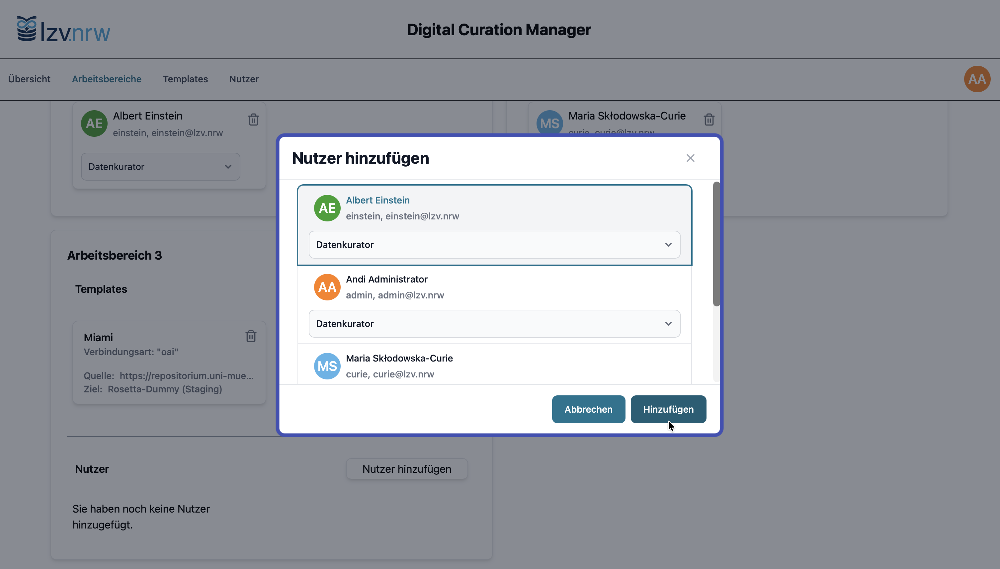{ .image-frame }

    Legen Sie fest, welche Nutzer:innen Zugriff auf einen Arbeitsbereich haben. Die Rolle *Datenkurator*  – derzeit die einzige verfügbare Rolle – ist bereits vorausgewählt.

-   **Vollständig konfigurierter Arbeitsbereich**

    ---

    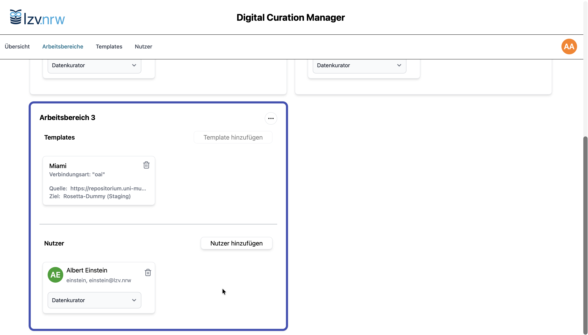{ .image-frame }

    Der Arbeitsbereich ist mit einem Nutzer und einem Template ausgestattet und somit vollständig konfiguriert – Albert Einstein kann nun Jobs für das Quellsystem *Miami* anlegen.

### Arbeitsbereichseinstellungen ändern

Jede Karte eines Arbeitsbereichs enthält ein *Drei-Punkte-Menü*, über das weitere Optionen aufgerufen werden können.

!!! tip "Löschen von Arbeitbereichen"
    Beim Löschen eines Arbeitsbereichs entfällt der Zugriff der Datenkurator:innen auf alle darin befindlichen Jobs. Löschen Sie einen Arbeitsbereich daher nur, wenn der Zugriff auf diese Jobs – einschließlich ihrer Historie – nicht mehr erforderlich ist.

    Die zugrunde liegenden Templates und Jobs bleiben beim Löschen eines Arbeitsbereichs im Hintergrund bestehen und können durch Zuweisung der Templates zu einem anderen Arbeitsbereich wieder nutzbar gemacht werden. Auch die Job-Historie wird für Datenkurator:innen mit entsprechender Berechtigung wieder sichtbar.

- { .image-frame}

Über das *Drei-Punkte-Menü* stehen Ihnen zwei Optionen zur Verfügung.  Sie können Arbeitsbereiche umbenennen, wenn sich etwa Projekttitel oder Organisationsstrukturen ändern, oder Arbeitsbereiche löschen, wenn sie nicht mehr benötigt werden.

## Templates verwalten

Templates enthalten die **technischen Konfigurationen zur Anbindung von Quellsystemen** und bilden die Grundlage für alle Jobs. In der Templateverwaltung werden Templates erstellt, angepasst und Arbeitsbereichen zugewiesen. Auf diese Weise steuern Administrator:innen, welche Templates Datenkurator:innen zum Anlegen neuer Jobs zur Verfügung stehen.

Der DCM unterscheidet zwei Template-Typen:

- **Hotfolder-Templates** für die Verarbeitung extern erstellter Information Packages
- **OAI-PMH-Templates** für automatisierte Harvesting-Prozesse  

### Templates anlegen

-   **Template erstellen**

    ---

    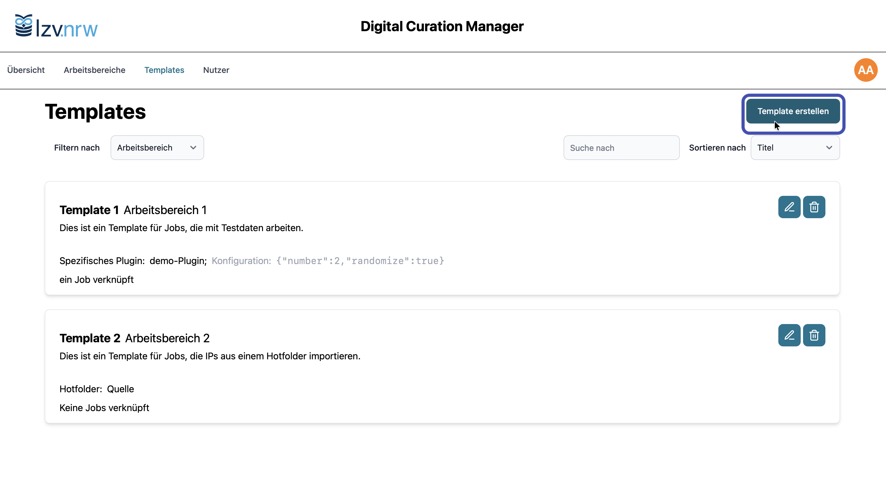{ .image-frame }

    Durch Klick auf die Schaltfläche *Template erstellen* oben rechts legen Sie ein neues Template an.

-   **Template beschreiben**

    ---

    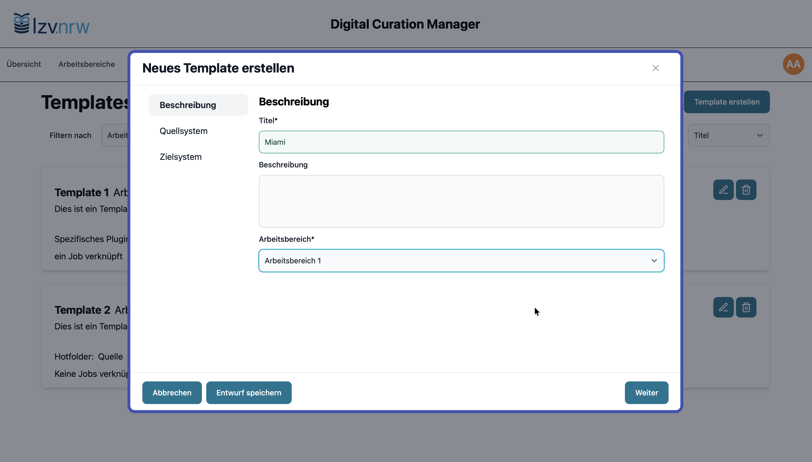{ .image-frame }

    Vergeben Sie einen aussagekräftigen Titel und optional eine Beschreibung. Wählen Sie anschließend den Arbeitsbereich, in dem das Template verwendet werden soll.

-   **Quellsystem wählen**

    ---

    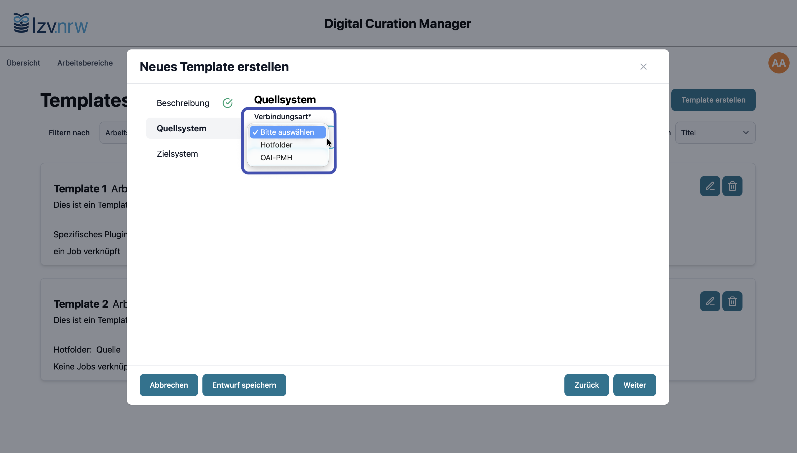{ .image-frame }

    Wählen Sie aus, ob das Template eine Hotfolder-Quelle **oder** eine OAI-PMH-Quelle anbinden soll.

-   **Hotfolder-Quelle konfigurieren**

    ---

    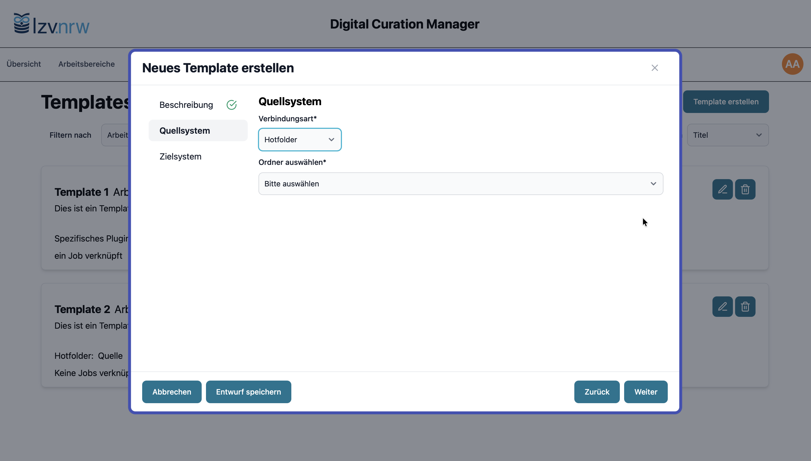{ .image-frame }

    **Hotfolder**: Wählen Sie das vorab konfigurierte Hotfolder-Verzeichnis aus der Liste aus. Weitere Einstellungen sind nicht erforderlich.

-   **OAI-PMH: Endpunkt konfigurieren**

    ---

    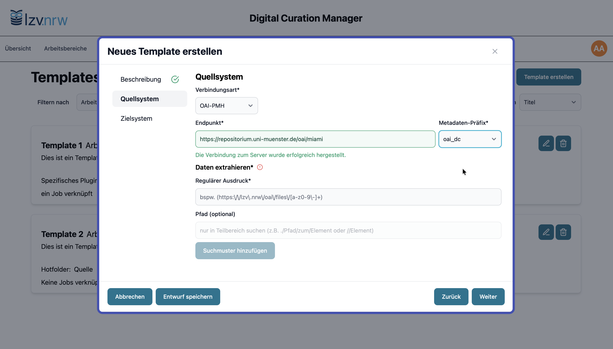{ .image-frame }

    **OAI-PMH**: Geben Sie die URL des OAI-Endpunkts an und wählen Sie anschließend das gewünschte Metadaten-Präfix. Es legt fest, welche Metadaten für das Mapping verwendet und als Quellmetadaten mitarchiviert werden.

-   **OAI-PMH: Payload extrahieren**

    ---

    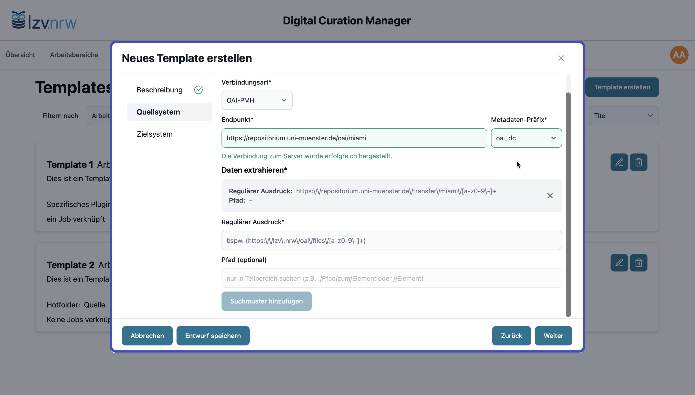{ .image-frame }

    **OAI-PMH**: Der DCM extrahiert Download-Links aus den Metadaten. Dazu wird ein regulärer Ausdruck benötigt, der die relevanten URLs identifiziert. Optional kann ein Pfad zur Eingrenzung hinterlegt werden.

-   **Zielsystem festlegen**

    ---

    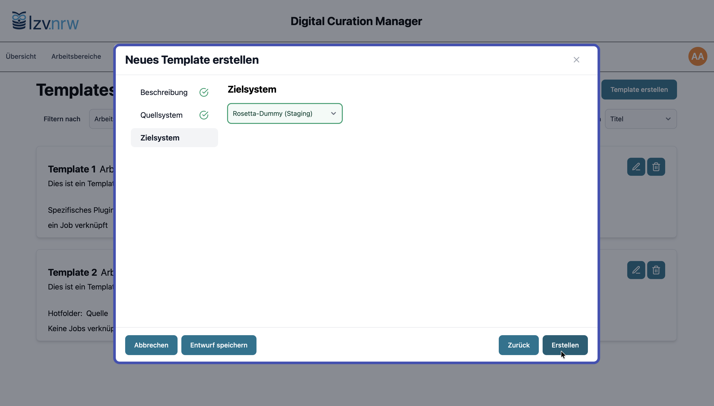{ .image-frame }

    Wählen Sie das Zielsystem aus, in das die erzeugten Information Packages überführt werden. Welche Systeme zur Auswahl stehen, hängt von der Systemkonfiguration ab.

### Templateeinstellungen ändern

Die Funktionen zur Bearbeitung der Templates stehen Ihnen auf jeder Template-Karte zur Verfügung.

!!! warning "Löschen von Templates"
    Beim Löschen eines Templates werden auch sämtliche mit diesem Template verknüpften Jobs unwiederbringlich gelöscht. Löschen Sie ein Template daher nur, wenn der Zugriff auf diese Jobs – einschließlich ihrer Historie – nicht mehr erforderlich ist.
    
    Im Gegensatz zum Entfernen eines Arbeitsbereichs ist dieser Vorgang endgültig.

-   **Aktionen für Templates**

    ---

    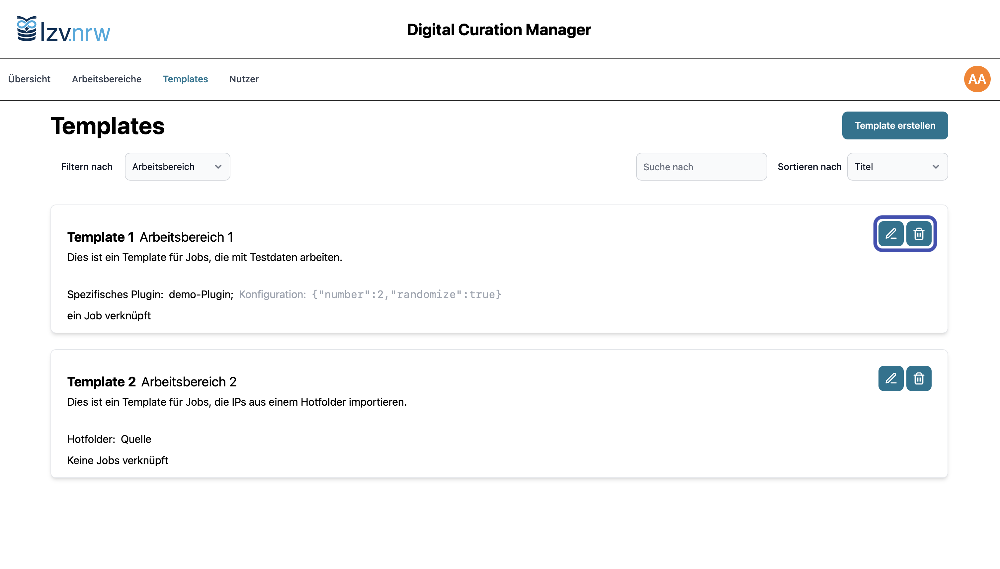{ .image-frame }

    Auf jeder Template-Karte stehen Ihnen die Aktionen *Bearbeiten* und *Löschen* zur Verfügung: 

    { .no-glightbox width="14px" } Template bearbeiten
    
    { .no-glightbox width="14px" } Template löschen

-   **Template bearbeiten**

    ---

    { .image-frame }

    Beim Bearbeiten sind zwei Einstellungen durch ein Gesperrt-Symbol <svg stroke="currentColor" fill="none" stroke-width="2" viewBox="0 0 24 24" stroke-linecap="round" stroke-linejoin="round" height="1em" width="1em" xmlns="http://www.w3.org/2000/svg"><rect x="3" y="11" width="18" height="11" rx="2" ry="2"></rect><path d="M7 11V7a5 5 0 0 1 10 0v4"></path></svg> gekennzeichnet und können nicht verändert werden: *Verbindungsart* und *Zielsystem*.

Die Sperre der Verbindungsart stellt sicher, dass bestehende Jobkonfigurationen auf Basis eines Templates gültig bleiben. 

Sollten Sie verschiedene Zielsysteme nutzen (z. B. Test- und Produktionsinstanzen), legen Sie getrennte, ansonsten identische Templates an. So wird ausgeschlossen, dass durch Änderungen am Template Jobs versehentlich in das falsche Zielsystem arbeiten.
