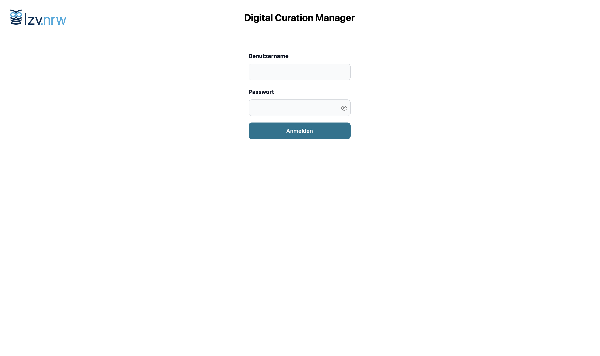
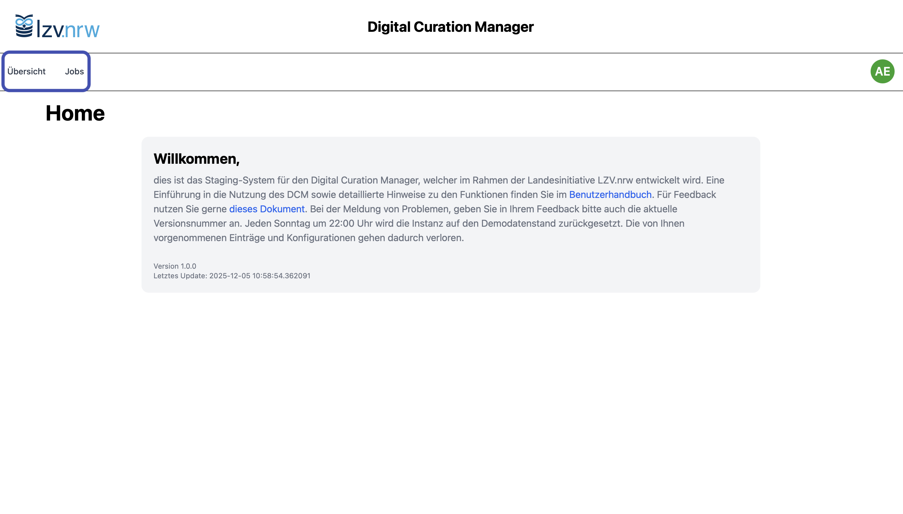
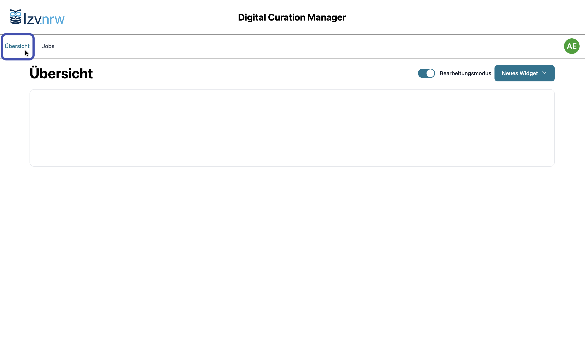
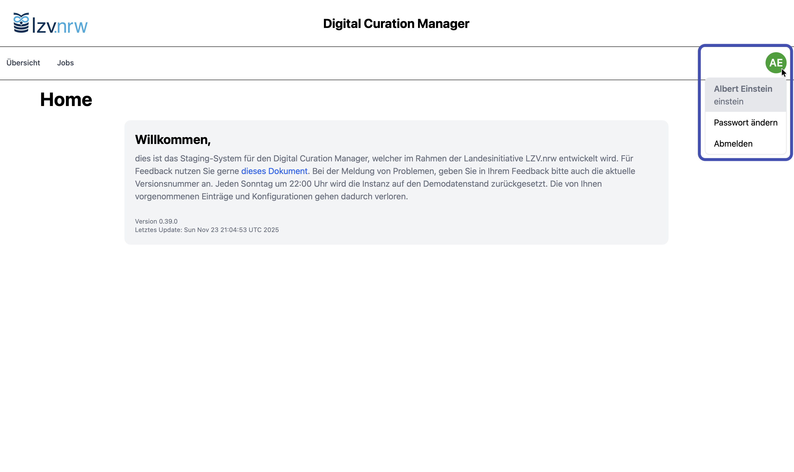

# Benutzeroberfläche

Die Benutzeroberfläche des Digital Curation Managers (DCM) ist bewusst klar und übersichtlich gestaltet. Sie bietet sowohl Datenkurator:innen als auch Administrator:innen einen leicht zugänglichen Zugang zu allen wichtigen Funktionen.

Nach dem Login über Ihren Browser gelangen alle Nutzer:innen zunächst auf eine gemeinsame Startseite. Die anschließende Navigation unterscheidet sich je nach Rolle:

Datenkurator:innen haben Zugriff auf die von ihnen verwalteten Jobs, während Administrator:innen Seiten für die Verwaltung von Nutzern, Arbeitsbereichen und Templates nutzen.

Unabhängig von Ihrer Rolle ist der grundlegende Aufbau der Oberfläche identisch:
Eine Navigationsleiste ermöglicht den schnellen Wechsel zwischen den Hauptbereichen. Rechts oben befindet sich das Profilmenü, über das die Funktionen zum Ändern des Passworts sowie der Logout erreichbar sind.

## Zentrale Elemente der Oberfläche

-   **Anmeldung**

    ---

    { .image-frame }

    Beim Aufruf der DCM URL melden Sie sich zunächst mit Ihrem persönlichen Account durch Eingabe von Nutzername und Passwort an.

-   **Startseite**

    ---

    { .image-frame }

    Nach dem Login gelangen Sie auf die Startseite. Als Datenkurator:in haben Sie über die Naviagtionsleiste oben Zugriff *Übersicht* und *Jobs*.

-   **Übersicht**

    ---

    { .image-frame }

    Hier entsteht zukünftig ein Dashboard, das Widgets wie Job-Status oder Benachrichtigungen anzeigen wird. Bis zur Umsetzung bleibt die Seite leer.

-   **Avatar-Menü**

    ---

    { .image-frame }

    Bei Klick auf das Avatar-Symbol können Sie Ihr Passwort ändern oder sich vom DCM abmelden. Beim nächsten Besuch der URL werden Sie erneut zum Login aufgefordert.

