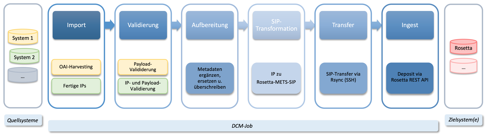
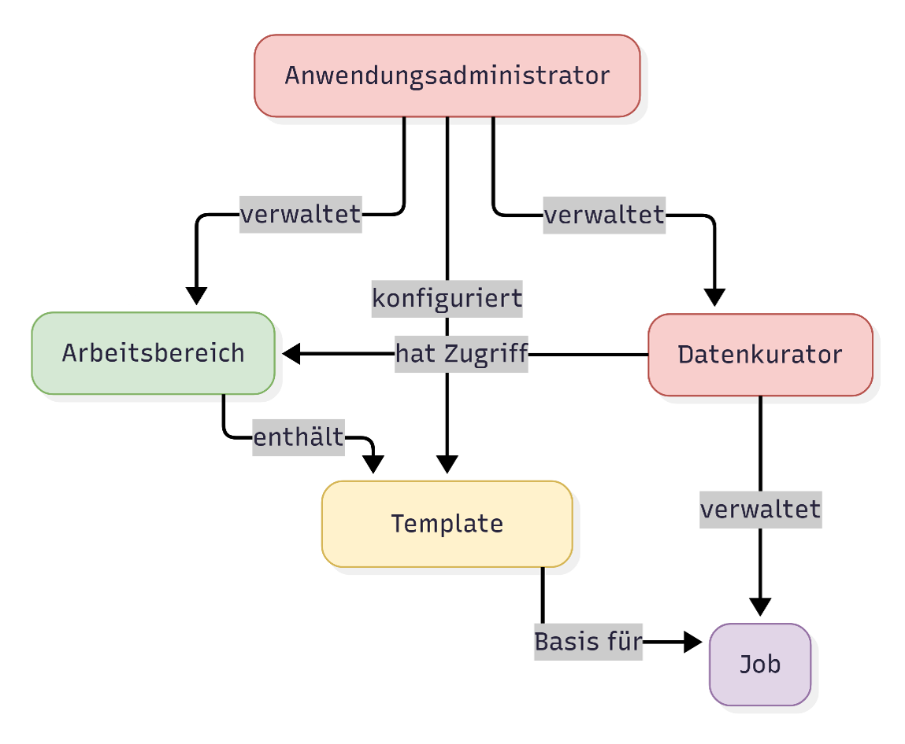
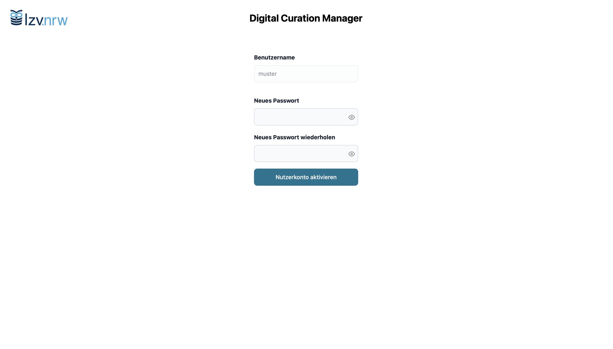

# Grundlagen

Der Digital Curation Manager (DCM) ist eine webbasierte Anwendung, mit der Datenkurator:innen digitale Objekte aus Quellsystemen auswählen, aufbereiten und in ein Langzeitarchivsystem[^1] überführen können.

Die Anwendung fungiert im Kern als Submission-Application und verknüpft mehrere Teilprozesse zu einem automatisierten Verarbeitungsworkflow. Dabei unterstützt der DCM sowohl Datenabfragen über Schnittstellen und automatische Dateidownloads als auch die Verarbeitung extern kuratierter und bereitgestellter Information Packages.

Der DCM schafft transparente und konsistente Abläufe. Die integrierte Weboberfläche führt alle Konfigurations- und Statusinformationen zentral zusammen und erleichtert die Orientierung im gesamten Workflow.

[^1]: Derzeit wird ExLibris Rosetta unterstüzt; weitere Systeme sind geplant.

## Arbeitsbereiche, Templates und Jobs

Der DCM strukturiert die Arbeitsabläufe in drei zentrale Bausteine.

**Arbeitsbereich** 
Arbeitsbereiche bündeln zusammengehörige Projekte oder Datenquellen und sorgen für eine klare organisatorische Struktur. Administrator:innen verwalten die Arbeitsbereiche und legen fest, welche Templates und Nutzer:innen ihnen zugeordnet sind. Für Datenkurator:innen ergibt sich daraus, welche Möglichkeiten sie im jeweiligen Bereich zum Anlegen und Bearbeiten von Jobs haben.

**Template** 
Templates werden von Administrator:innen erstellt. Sie enthalten die zentralen Einstellungen für die jeweilige Datenquelle und stellen sicher, dass technische Parameter bereits vorkonfiguriert sind. Für Datenkurator:innen bedeutet das, dass sie Jobs auf Grundlage einheitlicher und geprüfter Einstellungen anlegen können, ohne selbst technische Details anpassen zu müssen.

**Job** 
Jobs sind von Datenkurator:innen auf Basis eines Templates angelegte Konfigurationen, die beliebig oft ausgeführt werden können. Sie legen die für den jeweiligen Verarbeitungsvorgang notwendigen Einstellungen fest – etwa zur Datenauswahl, zu Metadaten-Mappings oder zu einem Zeitplan für wiederkehrende Läufe. Jobs bündeln die zugehörigen Archivierungsprozesse und erleichtern deren Statusnachverfolgung und Verwaltung.

## Rollen und Berechtigungen

Im DCM gibt es zwei Rollen, die unterschiedliche Verantwortungsbereiche abdecken.

 **Administrator** 
Administrator:innen verwalten Arbeitsbereiche, Nutzer, Rollen und Templates.

**Datenkurator** 
Datenkurator:innen arbeiten in Arbeitsbereichen, konfigurieren Jobs auf Basis von Templates und überwachen deren Ausführungen, Statusmeldungen sowie die verarbeiteten Intellectual Entities (IEs).

 
<figure markdown="span">
  { width="500" }
  <figcaption>Anwendungsstruktur und Rollen im DCM</figcaption>
</figure>

## Informationspakete

Der DCM arbeitet mit **Information Packages (IPs)**. Ein IP ist ein in sich konsistenter Container, der sowohl die Nutzdaten (Payload) als auch die zugehörigen Metadaten einer [Intellectual Entity](glossar.md#intellectual-entity-ie) umfasst. Es basiert auf dem [BagIt](glossar.md#bagit)-Standard, beschreibt sich vollständig selbst und kann als Pre-Ingest [Submission Information Package](glossar.md#submission-information-package-sip) verstanden werden.

Information Packages bilden das zentrale interne Verarbeitungsformat des DCM: Alle Verarbeitungsschritte operieren auf diesen IPs. Da IPs jedoch auch außerhalb des DCM erzeugt werden können, unterscheidet das System zwei Szenarien.

**Vom DCM erstellte Information Packages** 
Beim Import über [OAI-PMH](glossar.md#oai-pmh) erstellt der DCM die Information Packages automatisch. Diese IPs werden im Hintergrund verarbeitet und erscheinen im regulären Arbeitsablauf nicht. Erst im Fehlerfall kann es sinnvoll sein, ein solches IP herunterzuladen, um den Inhalt für die Analyse einzusehen.

**Extern erstellte Information Packages** 
Information Packages können auch in vorgelagerten Systemen oder Workflows entstehen und über einen überwachten [Hotfolder](glossar.md#hotfolder) an den DCM übergeben werden. Damit diese IPs validiert und weiterverarbeitet werden können, müssen sie einer kompatiblen IP-Spezifikation entsprechen.

!!! info "Information Packages: Spezifikationen und Kompatibilität"
     Extern erstellte Information Packages werden vom DCM auf Kompatibilität geprüft und validiert. Das jeweils verwendete Profil wird im Metadatum 'BagIt-Profile-Identifier' angegeben. Die aktuelle LZV.nrw IP-Spezifikation finden Sie hier: [https://github.com/lzv-nrw/spec-information-package](https://github.com/lzv-nrw/spec-information-package).

     Es ist auch möglich, eigene Profile zu verwenden – vorausgesetzt, sie sind vollständig kompatibel mit den Anforderungen des DCM. Eine Prüfung erfolgt bei der Verarbeitung des jeweiligen IPs.

Unabhängig davon, ob ein Information Package intern oder extern erzeugt wurde, wird es nach identischen Kriterien geprüft und verarbeitet.

Ob der DCM ein Information Package selbst erzeugt oder ein extern erstelltes IP übernimmt, wird in der jeweiligen Template-Konfiguration festgelegt. OAI-PMH-Jobs importieren zunächst nur Daten und Metadaten und erzeugen daraus automatisch ein IP. Hotfolder-Jobs dagegen verarbeiten gelieferte IPs, die von externen Systemen bereitgestellt werden.

Für Datenkurator:innen unterscheiden sich beide Jobtypen nur in wenigen Details – die zentralen Konfigurationsschritte und der praktische Umgang mit den Jobs sind gleich.

## DCM Nutzerkonto

!!! tip "Aktivierung des DCM Nutzerkontos"
    

    - { .image-frame }

    Datenkurator:innen erhalten einen personifizierten Link zur Aktivierung ihres DCM Nutzerkontos. Bei Aufruf des Links werden sie dazu aufgefordert, ein persönliches Passwort zu vergeben und das Nutzerkonto zu aktivieren. Das Passwort kann später bei Bedarf geändert werden.
    
    

