# Jobs konfigurieren

In diesem Kapitel werden alle Schritte beschrieben, die Datenkurator:innen beim Konfigurieren eines neuen Jobs im DCM durchlaufen. Alle Angaben können später über die Funktion *Bearbeiten* angepasst werden.

## Einen neuen Job anlegen

Auf der Seite *Jobs* starten Sie die Konfiguration eines neuen Jobs über den Job-Wizard.
Der Wizard führt Sie schrittweise durch alle erforderlichen Einstellungen und prüft Ihre Eingaben kontinuierlich. Fehlende oder ungültige Angaben werden dabei farblich hervorgehoben.

Zu Beginn legen Sie fest, in welchem Arbeitsbereich der Job angelegt werden soll, und wählen das Template aus, das die Grundlage der Jobkonfiguration bildet.

<div class="grid cards" markdown>

-   **Job-Konfiguration beginnen**

    ---

    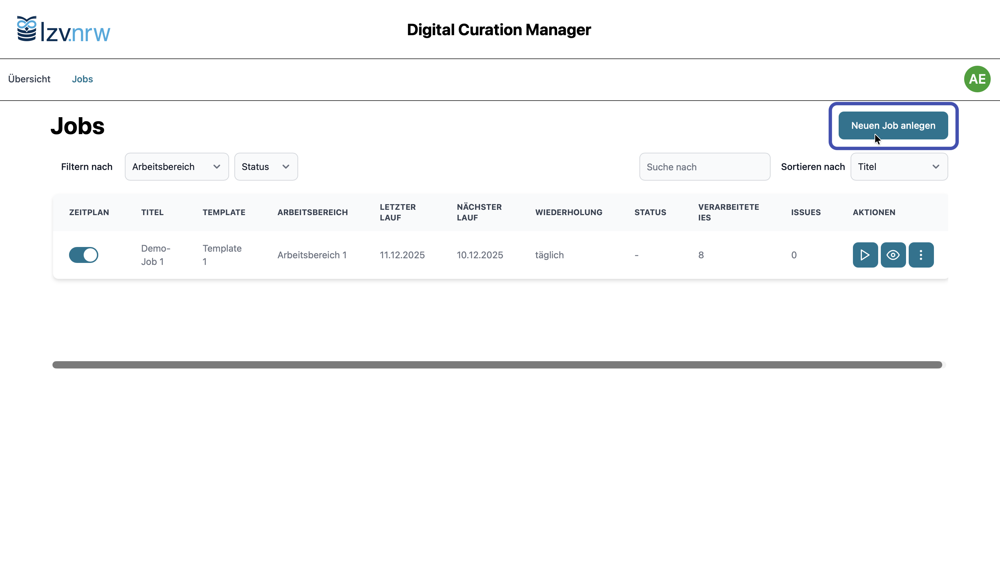{ .image-frame }

    Über den Button *Neuen Job anlegen* starten Sie den Job-Wizard.

-   **Arbeitsbereich auswählen**

    ---

    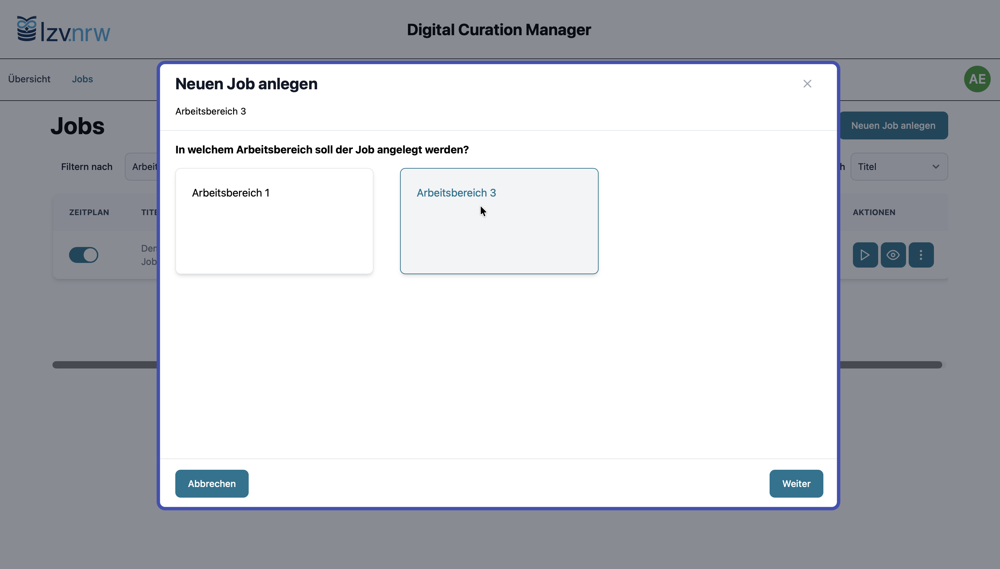{ .image-frame }

    Wählen Sie den Arbeitsbereich aus, in dem der Job konfiguriert werden soll.

-   **Template auswählen**

    ---

    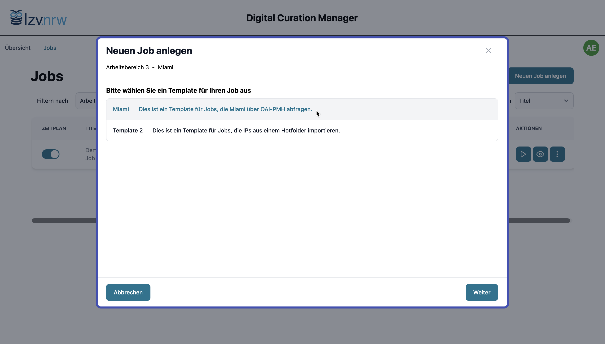{ .image-frame }

    Wählen Sie das Template aus, das als Grundlage für die Jobkonfiguration dient.

</div>

### Job beschreiben

In diesem Schritt erfassen Sie die grundlegenden Angaben zu Ihrem Job. Ein aussagekräftiger Titel erleichtert es, den Job später in der Übersicht eindeutig zu identifizieren.

In der Beschreibung können Sie zusätzliche Hinweise festhalten, die Ihnen oder Kolleg:innen beim Verständnis des Jobs helfen. 

Durch die Angabe eines Ansprechpartners für das Quellsystem stellen Sie sicher, dass bei Rückfragen zur Datenquelle schnell die richtige Kontaktperson erreicht werden kann.


<div class="grid cards" markdown>

- { .image-frame }

Erfassen Sie Titel, Beschreibung und Ansprechpartner für den Job.

</div>

### Daten auswählen

In diesem Schritt legen Sie fest, welche Daten der DCM im Rahmen des Jobs verarbeiten soll.
Die verfügbaren Optionen hängen vom gewählten Job-Typ ab und richten sich nach dem zugrunde liegenden Template.

#### OAI-PMH-Harvesting

Wenn das Template auf OAI-PMH basiert, haben Sie die Möglichkeit, die Auswahl der zu archivierenden Daten zeitlich und/oder auf ein oder mehrere Set(s) zu beschränken.

<div class="grid cards" markdown>

-   **Zeitraum eingrenzen**

    ---

    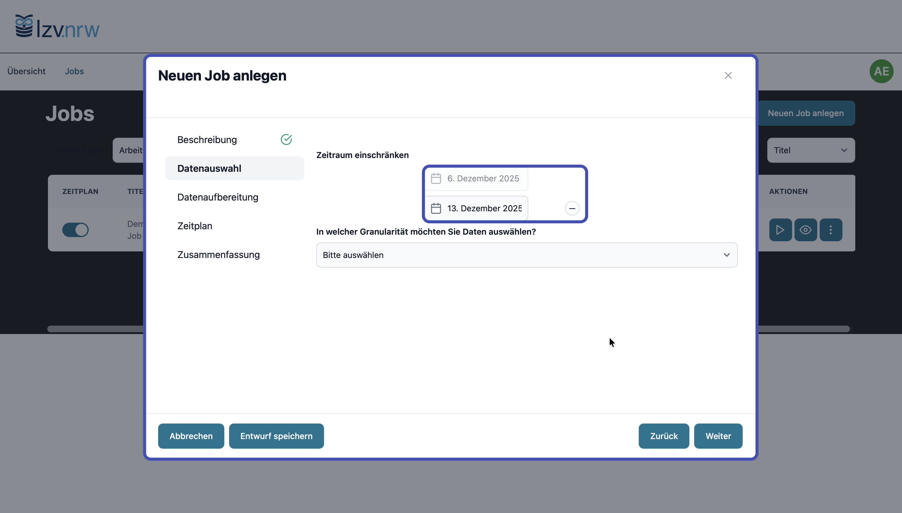{ .image-frame }

    Schränken Sie die Datenauswahl optional auf ein bestimmtes Startdatum oder einen Zeitraum ein.

-   **Sets auswählen**

    ---

    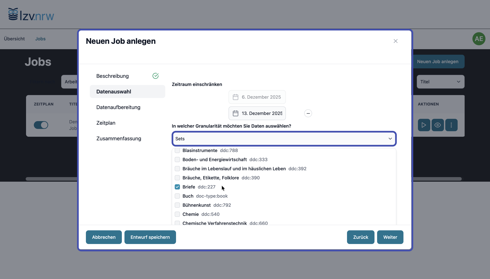{ .image-frame }

    Begrenzen Sie die Verarbeitung bei Bedarf auf ein oder mehrere Set(s).

</div>

#### Hotfolder

Wenn Sie mit extern erstellten IPs arbeiten, wählen Sie ein bestehendes Verzeichnis aus, das der DCM als Quelle nutzt. Der Assistent zeigt Ihnen alle verfügbaren Verzeichnisse an; bei Bedarf können Sie ein neues Verzeichnis erstellen, aus dem Information Packages geladen werden sollen.

!!! info
    Die hier angzeigten Verzeichnisse sind Unterverzeichnisse des von Administrator:innen mit dem Template verknüpften Hotfolders. Wie Sie Daten in diese Verzeichnisse übertragen, hängt von der Systemkonfiguration ab. Je nach Einrichtung des DCM können dafür unterschiedliche Verfahren genutzt werden, z.B. NFS, SMB oder SFTP. Welche Methode Sie verwenden, richtet sich nach der Konfiguration der Anwendungsumgebung.

    Jedes Verzeichnis kann mit genau einem Job verknüpft werden.

<div class="grid cards" markdown>

-   **Vorhandenes Verzeichnis auswählen**

    ---

    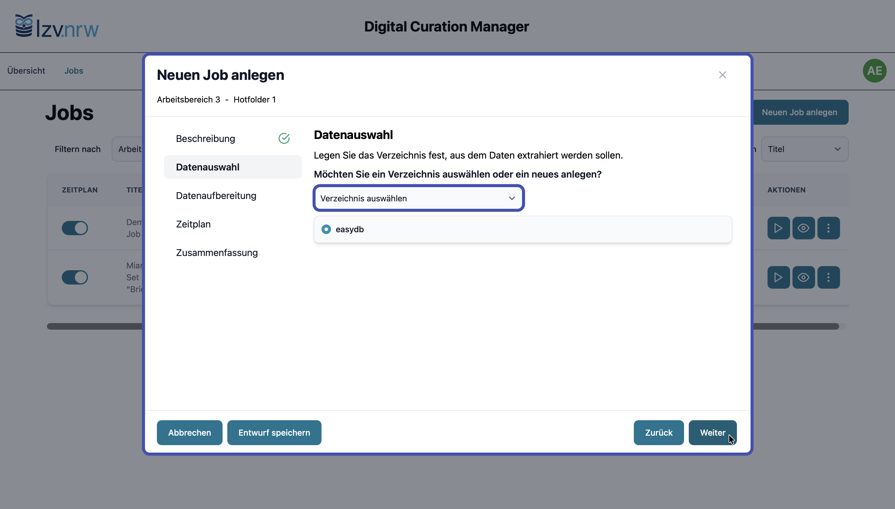{ .image-frame }

    Wählen Sie eines der vorhandenen Verzeichnisse für den Job aus, wenn dieses bereits existiert.

-   **Neues Verzeichnis anlegen**

    ---

    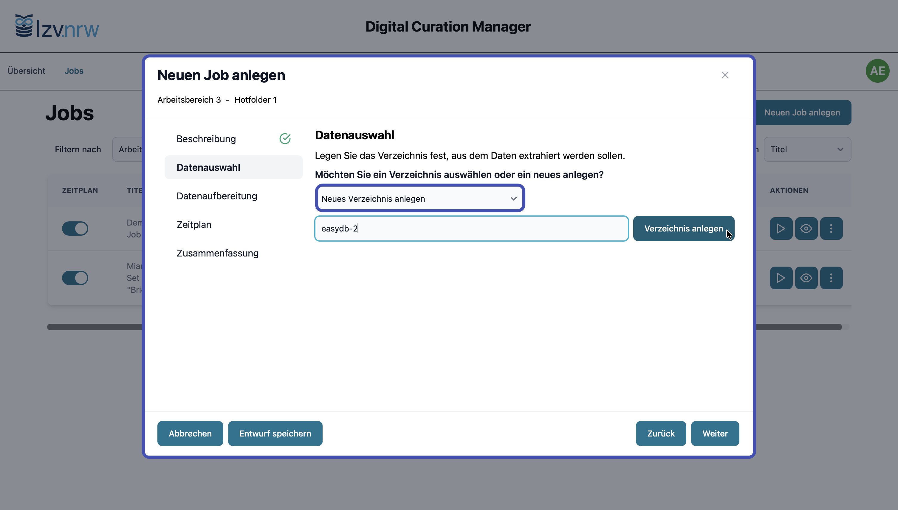{ .image-frame }

    Legen Sie bei Bedarf ein neues Verzeichnis an, wenn für diesen Job noch kein Verzeichnis vorgesehen ist.

</div>

### Daten aufbereiten

In diesem Schritt legen Sie fest, wie die Metadaten der Intellectual Entities während der Verarbeitung angepasst oder ergänzt werden. 
Dabei können Metadaten gezielt vereinheitlicht werden, um institutionelle Vorgaben oder projektbezogene Anforderungen umzusetzen.

Bei OAI-PMH-Jobs ist in diesem Schritt zusätzlich ein Mapping-Skript erforderlich, das die Übertragung der Metadaten aus dem Quellsystem in die IP-Struktur des DCM steuert.

Die Konfiguration erfolgt getrennt für die Bereiche *Rechte*, *Signifikante Eigenschaften* und *Preservation Level*. 
Die gewählten Einstellungen werden auf alle im Job verarbeiteten IEs angewendet.

#### Metadaten mappen
!!! info
    In Hotfolder-Jobs steht dieser Schritt nicht zur Verfügung.

In diesem Schritt laden Sie ein eigens für den Job zu erstellendes Mappingskript (Python oder XSLT) hoch, das der DCM für die Erstellung der Information Packages ausführt. Das Skript wird als Teil der Job-Konfigutation gespeichert und bei jeder Ausführung automatisch angewendet. 

 **Mappingskript hinzufügen**

<div class="grid cards" markdown>

- 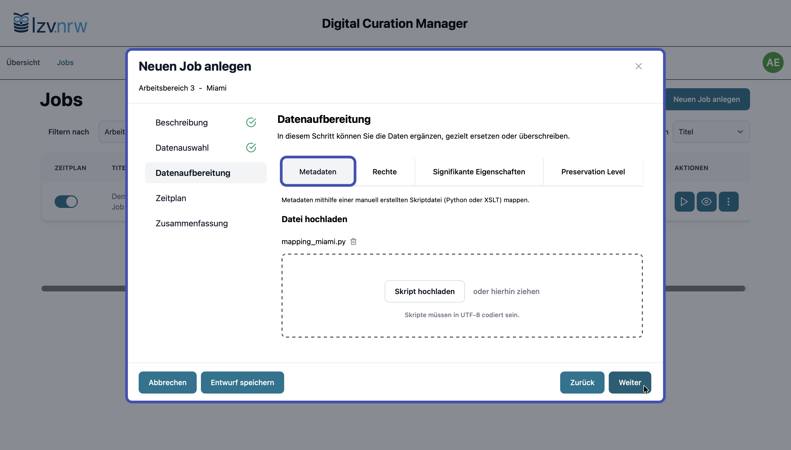{ .image-frame }

Für OAI-PMH-Jobs ist das Hochladen eines Mappingskripts erforderlich.

</div>

**Vom Quellsystem zum IP – so funktioniert das Mapping**

In diesem Abschnitt finden Sie zwei einfache Beispielskripte – eines in XSLT und eines in Python –, die zeigen, wie Metadaten aus Ihrem Quellsystem in die Struktur des Information Packages übertragen werden. Beide Skripte übernehmen dabei dieselbe Aufgabe: Sie lesen grundlegende Felder aus den gelieferten Metadaten aus und schreiben sie in die passenden IP-Metadaten hinein.

Die Beispiele sollen Ihnen den Einstieg erleichtern und können als Vorlage für Ihre eigenen Skripte dienen. Sie lassen sich leicht an unterschiedliche Quellen oder Projekterfordernisse anpassen. In beiden Beispielen wird mit Metadaten im Format Dublin Core (DC) gearbeitet.

??? "XSLT-Beispielskript"
    ```xslt
    <xsl:stylesheet xmlns:oai="http://www.openarchives.org/OAI/2.0/"
        xmlns:dc="http://purl.org/dc/elements/1.1/"
        xmlns:oai_dc="http://www.openarchives.org/OAI/2.0/oai_dc/"
        xmlns:xsl="http://www.w3.org/1999/XSL/Transform"
        exclude-result-prefixes="oai oai_dc dc"
        version="1.0">

        <xsl:output method="xml" indent="yes" encoding="UTF-8"/>
    
        <xsl:template match="/">
            <metadata>
                <xsl:apply-templates select="//oai_dc:dc"/>
            
                <!-- Static Origin-System-Identifier -->
                <field>
                    <xsl:attribute name="key">Origin-System-Identifier</xsl:attribute>
                    <xsl:text>My-System-Identifier</xsl:text>
                </field>
            
                <!-- Static Source-Organization -->
                <field>
                    <xsl:attribute name="key">Source-Organization</xsl:attribute>
                    <xsl:text>My-Organization</xsl:text>
                </field>
            
                <!-- External-Identifier from OAI Record Identifier -->
                <field>
                    <xsl:attribute name="key">External-Identifier</xsl:attribute>
                    <xsl:value-of select="//oai:record/oai:header/oai:identifier"/>
                </field>
            </metadata>
        </xsl:template>
    
        <!-- Template for mapping descriptive metadata from oai_dc:dc -->
        <xsl:template match="//oai_dc:dc">
            <xsl:for-each select="dc:creator">
                <field>
                    <xsl:attribute name="key">DC-Creator</xsl:attribute>
                    <xsl:value-of select="."/>
                </field>
            </xsl:for-each>

            <xsl:for-each select="dc:title">
                <field>
                    <xsl:attribute name="key">DC-Title</xsl:attribute>
                    <xsl:value-of select="."/>
                </field>
            </xsl:for-each>

            <xsl:for-each select="dc:rights">
                <field>
                    <xsl:attribute name="key">DC-Rights</xsl:attribute>
                    <xsl:value-of select="."/>
                </field>
            </xsl:for-each>
            
            <!-- DC-Identifier: only URN or DOI -->
            <xsl:for-each select="dc:identifier">
                <xsl:if test="contains(., 'urn:nbn') or starts-with(., '10.')">
                    <field>
                        <xsl:attribute name="key">DC-Terms-Identifier</xsl:attribute>
                        <xsl:value-of select="."/>
                    </field>
                </xsl:if>
            </xsl:for-each>
        </xsl:template>
    
    </xsl:stylesheet>
    ```

??? "Python-Beispielskript"
    ```python
    import re
    from pathlib import Path

    from dcm_ip_builder.plugins.mapping import GenericMapper
    from dcm_ip_builder.plugins.mapping.util import (
        XMLXPathMappingRule,
        load_xml_tree_from_file,
    )


    class ExternalMapper(GenericMapper):
        """Mapper for Miami-OAI-protocol to BagIt-metadata."""

        NAMESPACES = {
            "": "http://www.openarchives.org/OAI/2.0/",
            "oai_dc": "http://www.openarchives.org/OAI/2.0/oai_dc/",
            "dc": "http://purl.org/dc/elements/1.1/",
        }

        STATIC_METADATA = {
            "Origin-System-Identifier": "My-System-Identifier",
            "Source-Organization": "My-Organization",
        }

        LINEAR_RULES = [
            XMLXPathMappingRule(
                "/GetRecord/record/header/identifier",
                "External-Identifier",
                ns=NAMESPACES,
            ),
            XMLXPathMappingRule(
                "/GetRecord/record/metadata/oai_dc:dc/dc:creator",
                "DC-Creator",
                ns=NAMESPACES,
            ),
            XMLXPathMappingRule(
                "/GetRecord/record/metadata/oai_dc:dc/dc:title",
                "DC-Title",
                ns=NAMESPACES,
            ),
            XMLXPathMappingRule(
                "/GetRecord/record/metadata/oai_dc:dc/dc:rights",
                "DC-Rights",
                ns=NAMESPACES,
            ),
            XMLXPathMappingRule(
                "/GetRecord/record/metadata/oai_dc:dc/dc:identifier",
                "DC-Terms-Identifier",
                post_process=lambda x: (
                    None
                    if not x
                    else [
                        identifier
                        for identifier in x
                        if identifier is not None
                        and re.search(
                            r"10\.\d{4,9}/[-._;()/:A-Z0-9]+|^urn:nbn:[a-zA-Z0-9\-:.]+",
                            identifier,
                            re.IGNORECASE,
                        )
                    ]
                ),
                ns=NAMESPACES,
            ),
        ]

        def get_metadata(self, path, /, **kwargs):
            tree = load_xml_tree_from_file(Path(path))
            metadata = self.STATIC_METADATA.copy()
            for rule in self.LINEAR_RULES:
                try:
                    metadata[rule.dst] = rule.map(tree)
                # pylint: disable=broad-exception-caught
                except Exception:
                    pass
            return metadata
    ```

#### Metadaten vereinheitlichen

In diesem Schritt legen Sie fest, wie der DCM Metadaten während der Verarbeitung anpassen oder ergänzen soll. Für jede der drei Metadatengruppen *Rechte*, *Signifikante Eigenschaften* und *Preservation Level* stehen Ihnen drei Aktionen zur Verfügung.

- **Ergänzen:** Fügt das angegebene Feld hinzu, wenn es in den Ausgangsmetadaten noch nicht vorhanden ist.  
- **Ersetzen:** Tauscht den vorhandenen Wert eines Feldes durch einen neuen Wert aus.  
- **Überschreiben:** Ersetzt alle vorhandenen Vorkommen eines Feldes und setzt es vollständig auf den angegebenen Wert.  

Mit diesen Einstellungen steuern Sie, wie Metadaten vereinheitlicht oder angereichert werden sollen – etwa um institutionelle Anforderungen oder Policies umzusetzen. Die gewählten Aktionen werden auf alle IEs angewendet, die im Rahmen dieses Jobs verarbeitet werden (Batch-Verarbeitung).

Sämtliche Einstellungen sind optional.

!!! tip "Aktionen gezielt kombinieren"
    Sie können einzelne Aktionen kombinieren.
    
    Ein typisches Beispiel: Ein vorhandener Wert kann **überschrieben** werden, während fehlende Felder gleichzeitig **ergänzt** werden – so stellen Sie sicher, dass IEs mit heterogenen Ausgangsmetadaten normalisiert werden.  

    Ebenso können Sie bestimmte Ausgangswerte gezielt **ersetzen** und bei fehlenden Feldern automatisch einen neuen Standardwert **ergänzen**.  
    
    Beachten Sie: **Überschreiben** und **Ersetzen** schließen sich gegenseitig aus, da Überschreiben immer Vorrang hat!

##### Rechte

In diesem Abschnitt legen Sie fest, wie rechtebezogene Metadaten für die Intellectual Entities gesetzt oder vereinheitlicht werden.

Die hier konfigurierten Felder beziehen sich auf die entsprechenden Einträge in der *bag-info.txt* gemäß der IP-Spezifikation. 
Auf diese Weise können Rechteinformationen gezielt ergänzt, ersetzt oder überschrieben werden, um eine konsistente und institutionskonforme Beschreibung der archivierten Objekte sicherzustellen.

<div class="grid cards" markdown>

-   **Rechte konfigurieren**

    ---

    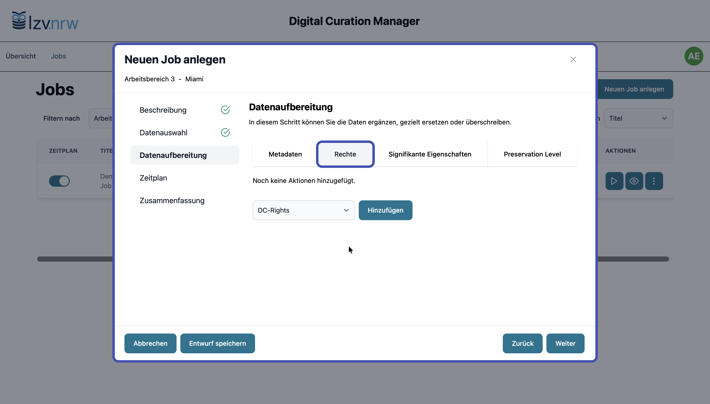{ .image-frame }

    In diesem Tab konfigurieren Sie rechtebezogene Metadaten für alle IEs.

-   **Felder auswählen**

    ---

    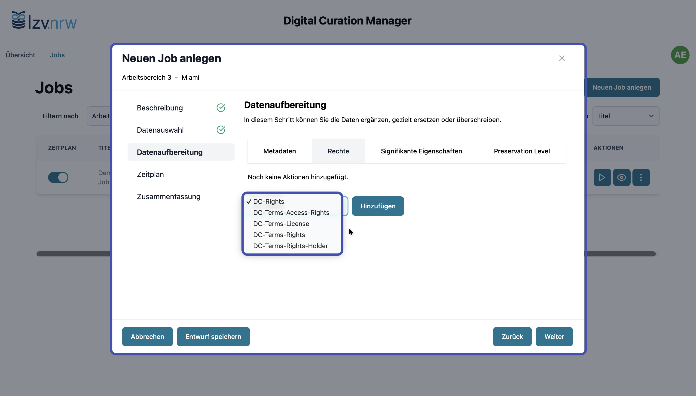{ .image-frame }

    Wählen Sie die Felder aus, die angepasst werden sollen.

-   **Aktionen festlegen**

    ---

    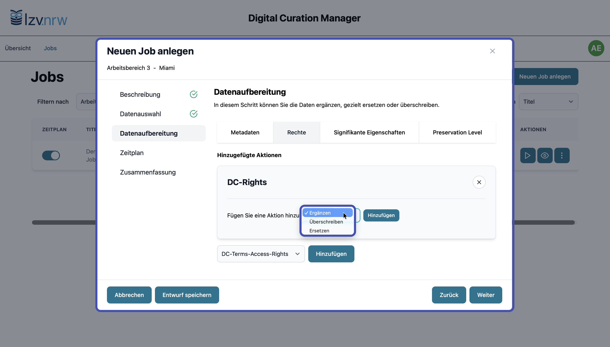{ .image-frame }

    Legen Sie fest, ob Werte ergänzt, ersetzt oder überschrieben werden.

-   **Werte eintragen**

    ---

    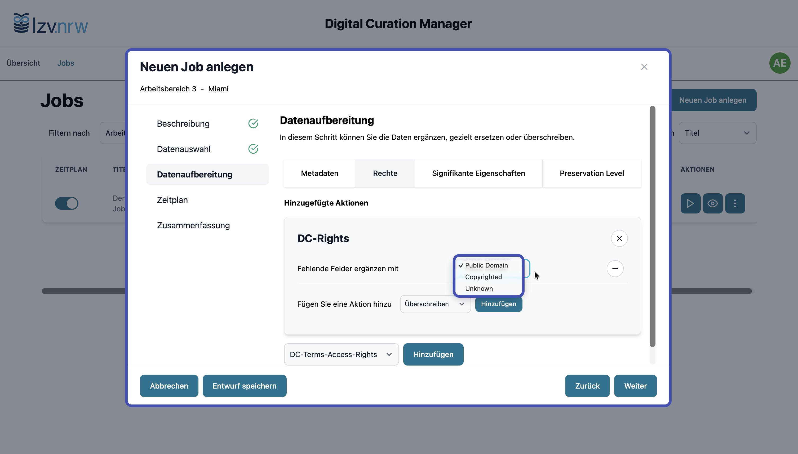{ .image-frame }

    Hinterlegen Sie die gewünschten Werte für die gewählten Aktionen. Die Auswahlmöglichkeiten entsprechen den Anforderungen und Empfehlungen der aktuellen IP-Spezifikaion.

</div>

##### Signifikante Eigenschaften

Unter *Signifikante Eigenschaften* erfassen Sie in diesem Schritt Eigenschaften, die für die langfristige Nutzbarkeit und Interpretierbarkeit der Intellectual Entities relevant sind.

Dabei handelt es sich nicht um technische signifikante Eigenschaften, wie sie von Langzeitarchivierungssystemen wie Rosetta beim Ingest automatisch ermittelt werden. Stattdessen werden hier intellektuell erfasste Eigenschaften beschrieben, die sich auf die Bedeutung verschiedener Aspekte für die Nutzung der Objekte beziehen. Die Signifikanten Eigenschaften werden in fünf Kategorien gegliedert: *Aussehen*, *Verhalten*, *Inhalt*, *Kontext*, *Struktur*

<div class="grid cards" markdown>

-   **Eigenschaften konfigurieren**

    ---

    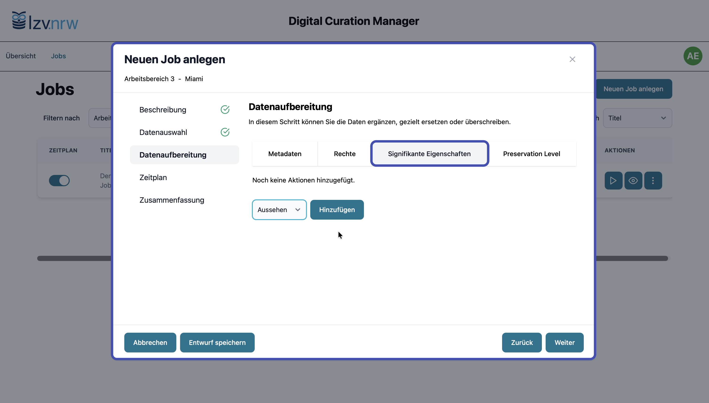{ .image-frame }

    In diesem Tab konfigurieren Sie Signifikante Eigenschaften für alle IEs.

-   **Optionen auswählen**

    ---

    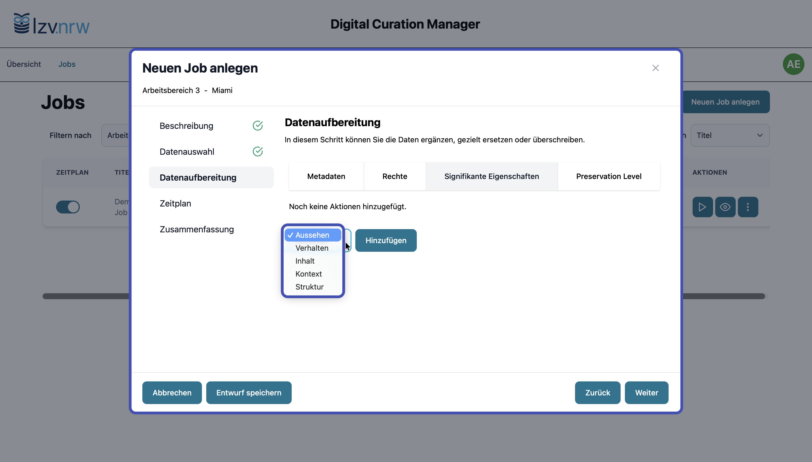{ .image-frame }

    Wählen Sie eine der fünf Kategorien aus.

-   **Aktionen festlegen**

    ---

    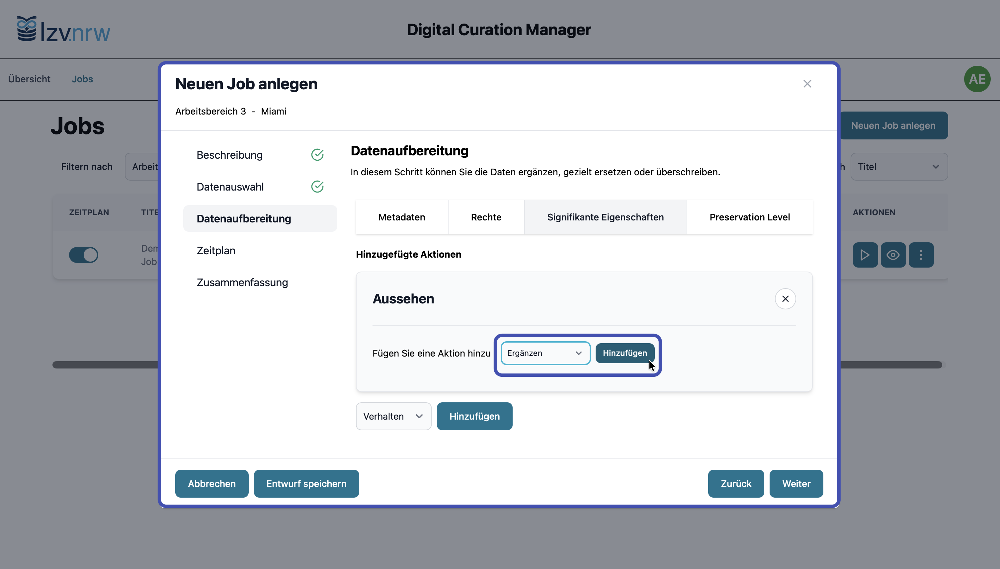{ .image-frame }

    Legen Sie für jede Eigenschaft fest, ob sie ergänzt, ersetzt oder überschrieben wird. Anschließend haben Sie die Möglichkeit, die Eigenschaft als Freitext einzugeben.

</div>

##### Preservation Level

In diesem Abschnitt legen Sie das Metadatum *Preservation Level* fest, das für die im Job verarbeiteten Intellectual Entities gelten soll.

Das Preservation Level beschreibt die angestrebte Tiefe der Langzeitarchivierung und gibt an, in welchem Umfang Erhaltungsmaßnahmen angewendet werden sollen. Es wird damit keine eindeutige Aussage über die Möglichkeit, reine Absicht oder strikte Anforderung verknüpft. Die Interpretation obliegt der archivierenden Institution.

<div class="grid cards" markdown>

-   **Preservation Level konfigurieren**

    ---

    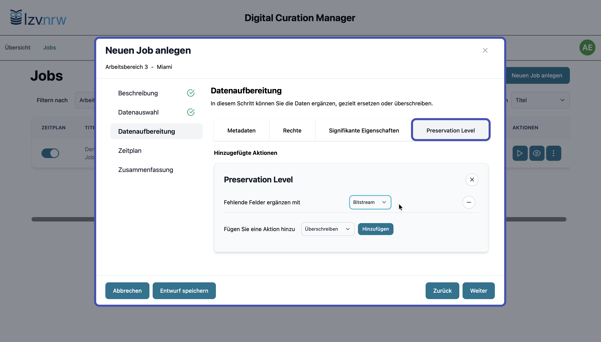{ .image-frame }

    In diesem Tab konfigurieren Sie den Preservation Level für alle verarbeiteten IEs.

-   **Preservation Level auswählen**

    ---

    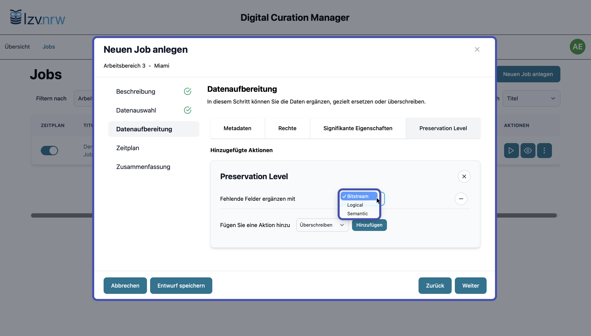{ .image-frame }

    Wählen Sie den passenden Preservation Level aus den verfügbaren Optionen aus.

</div>

### Zeitplan festlegen

In diesem Schritt legen Sie fest, ob und wann der Job automatisch ausgeführt werden soll. 
Sie definieren einen Startzeitpunkt und optional ein Wiederholungsintervall.

Ohne Zeitplan kann der Job ausschließlich manuell gestartet werden. 
Auch bei Jobs mit aktivem Zeitplan bleibt eine manuelle Ausführung jederzeit möglich.

<div class="grid cards" markdown>

-   **Zeitplan definieren**

    ---

    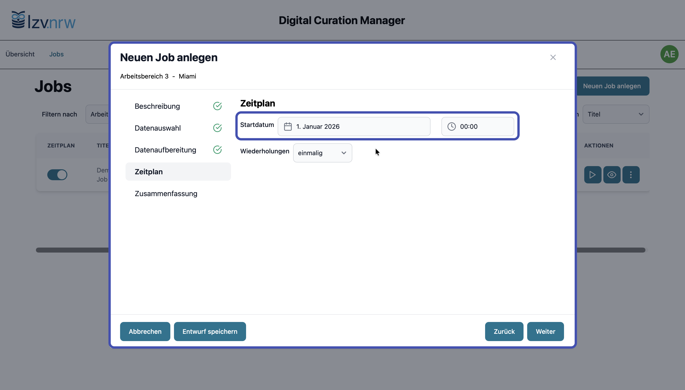{ .image-frame }

    Legen Sie fest, wann der Job automatisch ausgeführt werden soll.

-   **Wiederholungsintervall festlegen**

    ---

    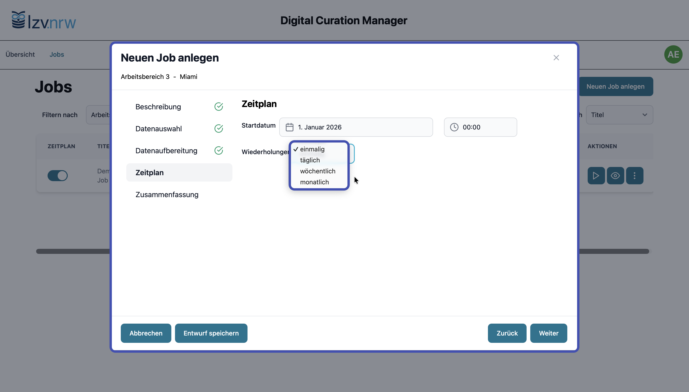{ .image-frame }

    Legen Sie ein Wiederholungsintervall für die automatische Ausführung fest.

</div>

### Einstellungen prüfen und Job anlegen

#### Job testen  

Bevor Sie den Job endgültig anlegen, können Sie optional einen Testlauf durchführen. 
Der Test simuliert alle Verarbeitungsschritte und ermöglicht es, Fehlkonfigurationen frühzeitig zu erkennen.

<div class="grid cards" markdown>

- 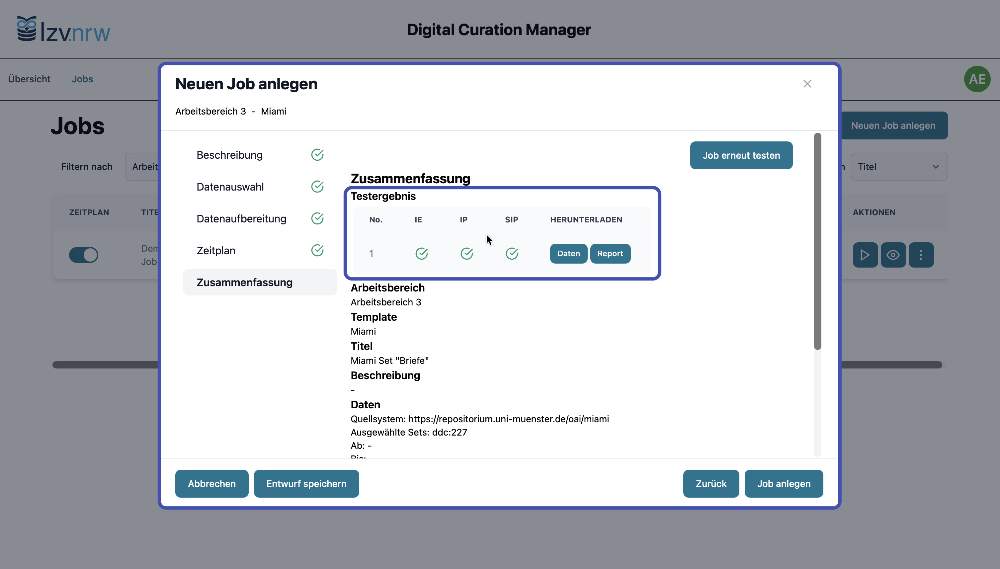{ .image-frame }

Testen Sie die Jobkonfiguration, ohne einen echten Ingest auszuführen.<br><br>Im Anschluss an den Testlauf können verarbeitete Dateien und Reports heruntergeladen werden. Dies erleichtert die Qualitätskontrolle und eine gezielte Fehleranalyse.

</div>

#### Job anlegen

!!! tip "Entwurf speichern"
    Alternativ zum direkten Anlegen von Jobs können Sie die Konfiguration jederzeit als Entwurf speichern. Der Job erhält in diesem Fall den Status *Entwurf* und kann zu einem späteren Zeitpunkt weiterbearbeitet und abgeschlossen werden.

<div class="grid cards" markdown>

- 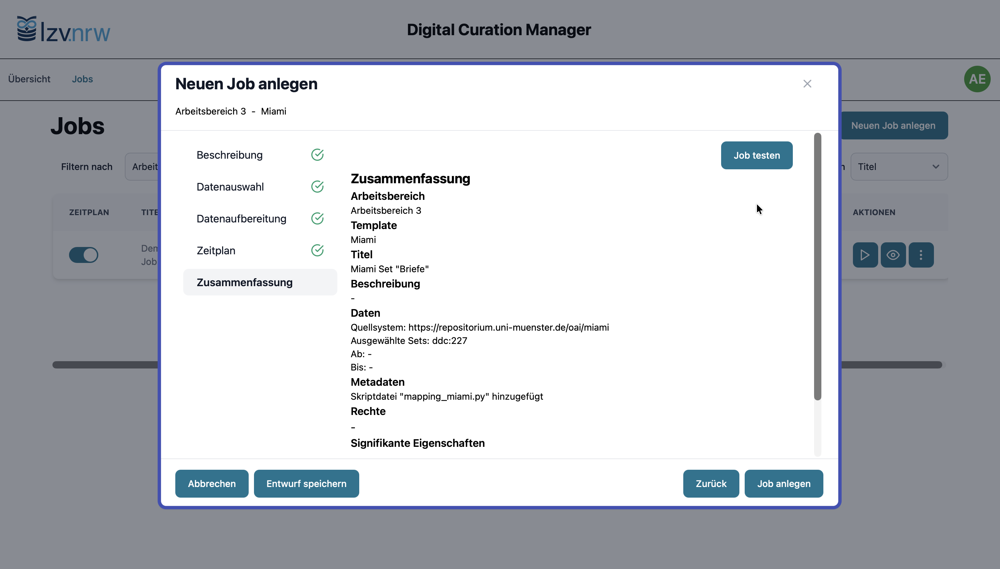{ .image-frame }

Die Zusammenfassung zeigt bereits unabhängig vom Testlauf alle gewählten Einstellungen. Mit einem Klick auf *Job anlegen* wird die Konfiguration abgeschlossen. 

- 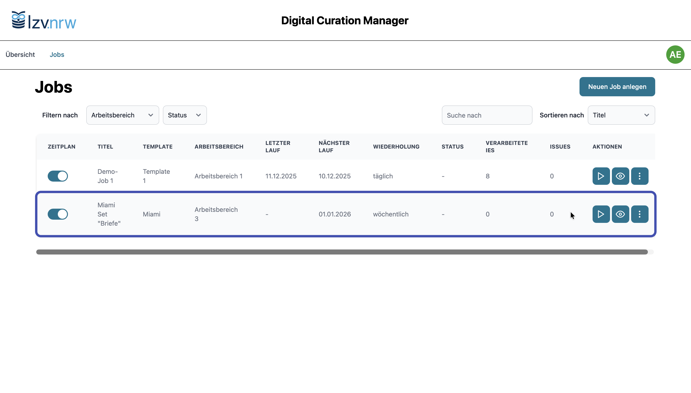{ .image-frame }

Nach einem Klick auf *Job anlegen* erscheint der Job in der Job-Übersicht. 
Sofern ein Zeitplan definiert wurde, ist dieser automatisch aktiv.

</div>

Nach dem Anlegen eines Jobs können Sie diesen manuell starten, automatisch ausführen lassen und den Fortschritt überwachen. 
Informationen zur Verwaltung und Überwachtung finden Sie im Kapitel [Jobs managen und überwachen](jobs-managen-und-ueberwachen.md).
