# Jobs managen und überwachen

In diesem Kapitel erfahren Sie, wie Sie bestehende Jobs im laufenden Betrieb überwachen, steuern und bei Fehlern gezielt die weitere Verarbeitung von Intellectual Entities beeinflussen können.

## Job-Übersicht nutzen

Die Tabelle auf der Seite *Jobs* zeigt eine Übersicht aller angelegten Jobs in den Arbeitsbereichen, auf die Sie Zugriff haben. Sie enthält grundlegende Informationen wie den aktuellen Status oder den nächsten geplanten Lauf (falls vorhanden). 

Über Filter und eine Suchfunktion können gezielt bestimmte Jobs ein- oder ausgeblendet werden.

Darüber hinaus stehen verschiedene Steuerelemente zur Verfügung, mit denen sich Jobs direkt verwalten lassen. 

- 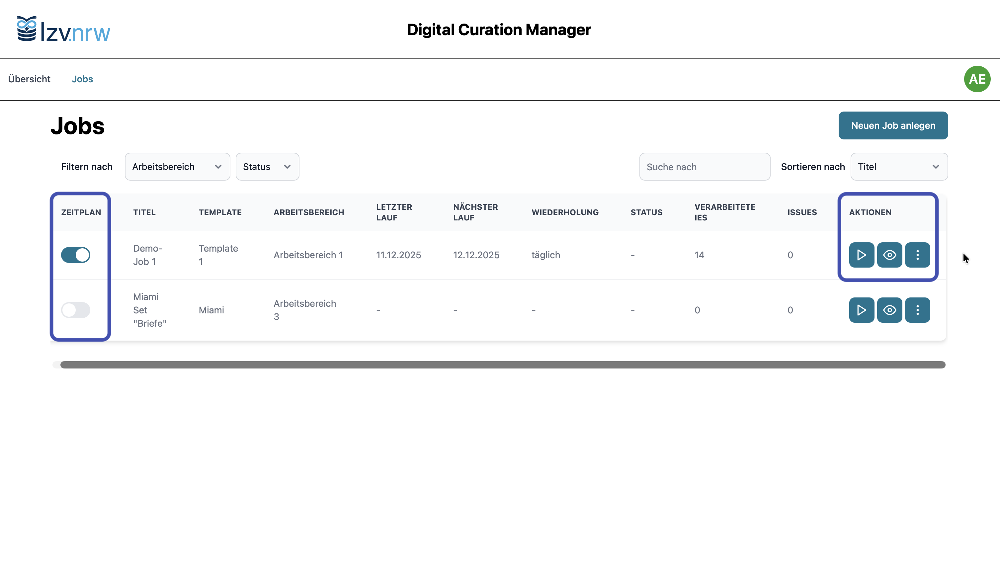{ .image-frame }

Steuerelemente in der Job-Übersicht auf der Seite *Jobs*.

### Jobs in der Übersicht verwalten

{ .no-glightbox width="14px" } | { .no-glightbox width="14px" } **Zeitplan aktivieren oder pausieren**  
Über den Schalter kann der Zeitplan eines Jobs jederzeit pausiert oder wieder aktiviert werden. Beim Deaktivieren werden keine automatisierten Ausführungen mehr gestartet; manuelle Starts bleiben weiterhin möglich. Die Option steht nur bei Jobs mit *Zeitplan* zur Verfügung.

{ .no-glightbox width="14px" } | { .no-glightbox width="14px" } **Job starten oder abbrechen**   
Führt den Job manuell aus, unabhängig davon, ob ein Zeitplan definiert ist. Die Verarbeitung laufender Jobs kann abgebrochen werden.

{ .no-glightbox width="14px" } **Job-Details öffnen**  
Öffnet die Detailseite eines Jobs mit Informationen zu verarbeiteten Intellectual Entities (IEs), Fehlermeldungen und Reports.

{ .no-glightbox width="14px" } **Weitere Optionen**

: **Job-Report herunterladen**  
  Ermöglicht den Download des ausführlichen Ergebnis- und Fehlerreports der letzten Job-Ausführung.

: **Job bearbeiten**  
  Öffnet den Job-Wizard zur Konfiguration des Jobs.

: **Job löschen**  
  Entfernt den Job dauerhaft. *Achtung*: Dadurch geht die vollständige Ausführungs- und Verarbeitungshistorie des Jobs unwiderruflich verloren.

## Job Details einsehen

Über die Job Details erhalten Sie einen vertieften Einblick in die Ausführungshistorie eines Jobs sowie in die Verarbeitung der zugehörigen Intellectual Entities. 
Hier lassen sich vergangene Job-Läufe nachvollziehen, der Status einzelner Intellectual Entities prüfen und bei Bedarf detaillierte Reports und Verarbeitungsartefakte abrufen. 
Auch der Umgang mit Fehlern bei der [Objektvalidierung](glossar.md#objektvalidierung) erfolgt in dieser Ansicht.

- 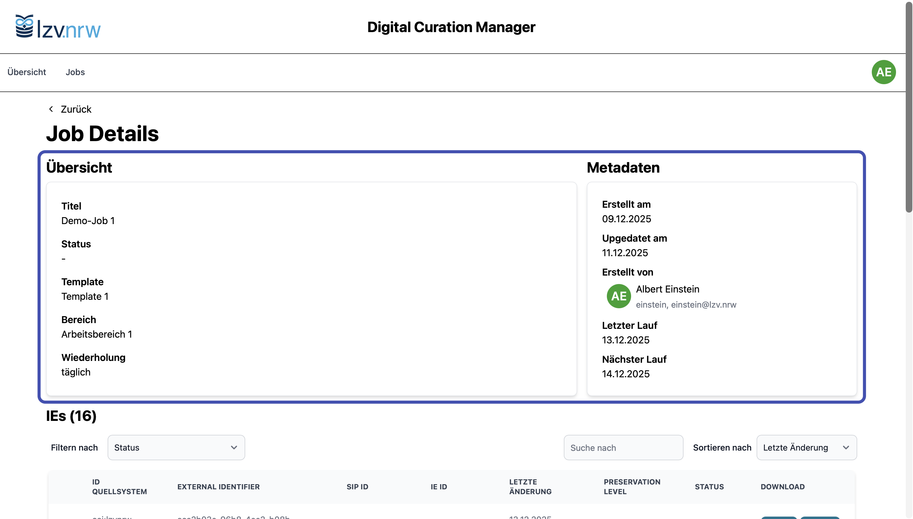{ .image-frame }

    Die Job Details zeigen alle bisherigen Ausführungen eines Jobs sowie den Status der jeweils verarbeiteten Intellectual Entities (IEs). Im Kopfbereich finden Sie den Gesamtstatus des Jobs und weitere allgemeine Informationen. 

- 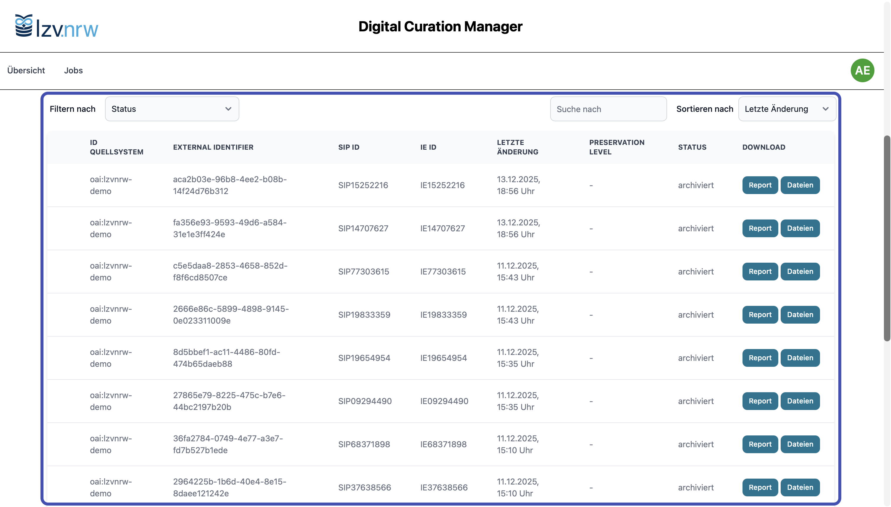{ .image-frame }

    Die darunterliegende Tabelle listet alle IEs der gesamten Job-Historie mit ihren Statuswerten, Validierungsergebnissen und Zeitstempeln. Über Filter und die Suchfunktion können Sie gezielt nach bestimmten IEs oder nach IEs mit Fehlern suchen.

- 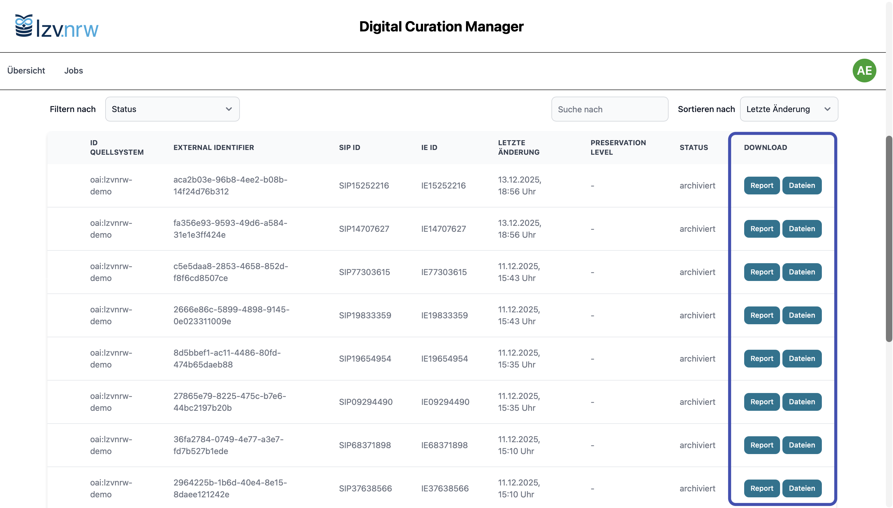{ .image-frame }

    Für jede IE lassen sich Reports herunterladen. Bei IEs, die nicht erfolgreich verarbeitet wurden, stehen außerdem (zeitlich begrenzt) die einzelnen Verarbeitungsstufen – IE, IP und SIP – als Download zur Verfügung.

## Automatische Reaktion auf Fehler

Tritt während der Ausführung ein kritischer Fehler auf, der aufgrund einer ungültigen IP-Struktur auf eine grundlegende Problematik in der Job-Konfiguration hinweist, wird die automatische Ausführung gemäß Zeitplan deaktiviert. Dadurch werden wiederholte Fehlversuche verhindert und eine kontrollierte Fehlerbehandlung ermöglicht.

-   **Automatische Ausführung aktiviert**

    ---

    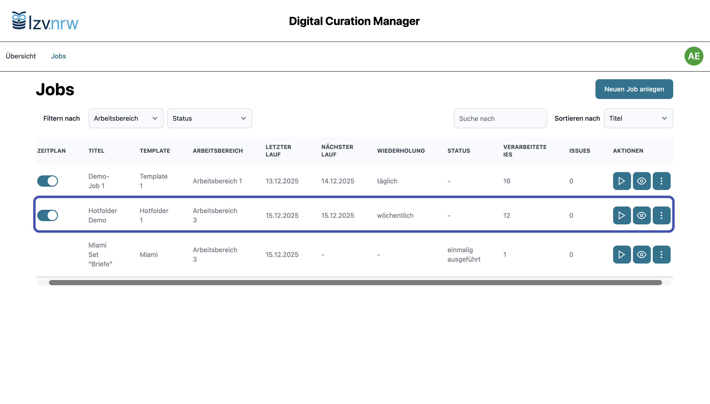{ .image-frame }

    Der Job ist für die automatische Ausführung gemäß Zeitplan vorgesehen.

-   **Zeitplan automatisch deaktiviert**

    ---

    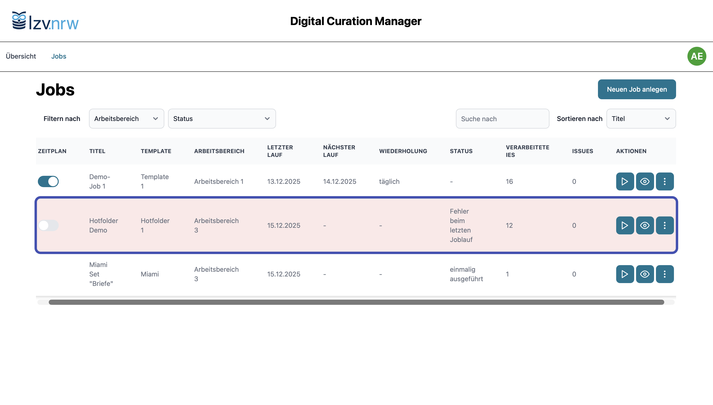{ .image-frame }

    Bei einem kritischen Strukturfehler wird er Job als fehlerhaft gekennzeichnet und die automatische Ausführung deaktiviert.

Nach der Fehlerbehebung – z.B. Korrekturen am Mappingskript – kann der Job manuell neu gestartet oder durch erneutes Aktivieren des Schalters wieder in den Zeitplan eingebunden werden. Im Fall von OAI-PMH werden fehlgeschlagene IEs automatisch erneut verarbeitet. Ablieferungen über Hotfolder müssen erneut bereitgestellt werden. 

## Fehler analysieren und behandeln

Während der Jobausführung können Fehler auftreten, etwa aufgrund struktureller Probleme (siehe Abschnitt [Automatische Reaktion auf Fehler](#automatische-reaktion-auf-fehler)) oder bei der Validierung einzelner Intellectual Entities. 
Der DCM kennzeichnet solche Fälle eindeutig und stellt Werkzeuge zur Analyse und gezielten Weiterverarbeitung bereit.

### Validierungsfehler erkennen

-   **Job mit Validierungsfehler identifizieren**

    ---

    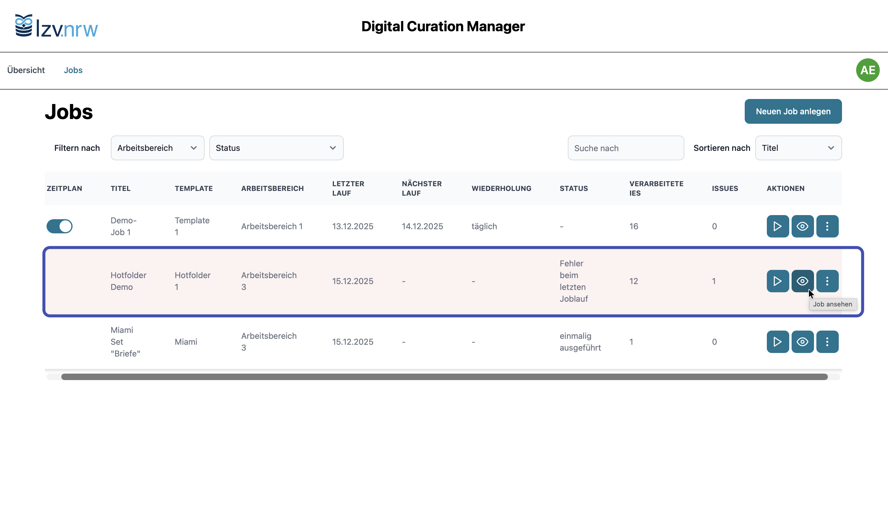{ .image-frame }

    Ein roter Hervorhebungsstatus und entsprechende Hinweise im Job-Report weisen auf Validierungsfehler hin.

-   **Fehlerhafte IEs in den Job-Details erkennen**

    ---

    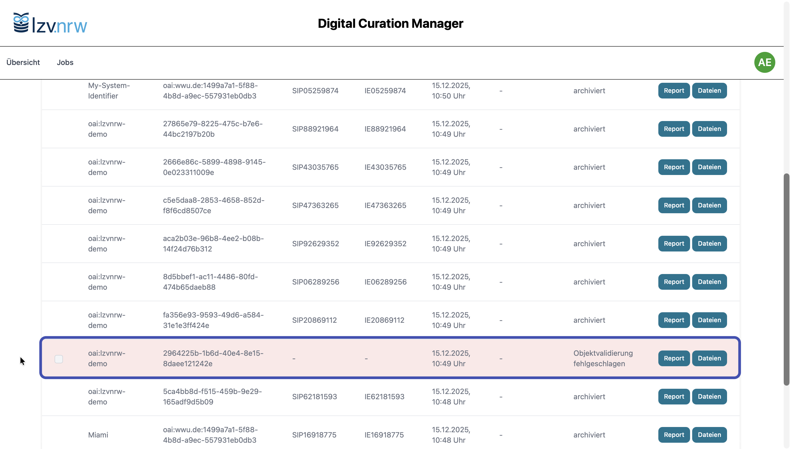{ .image-frame }

    Fehlerhafte Intellectual Entities werden in der Detailansicht farblich hervorgehoben.

-   **Fehlerhafte IEs filtern**

    ---

    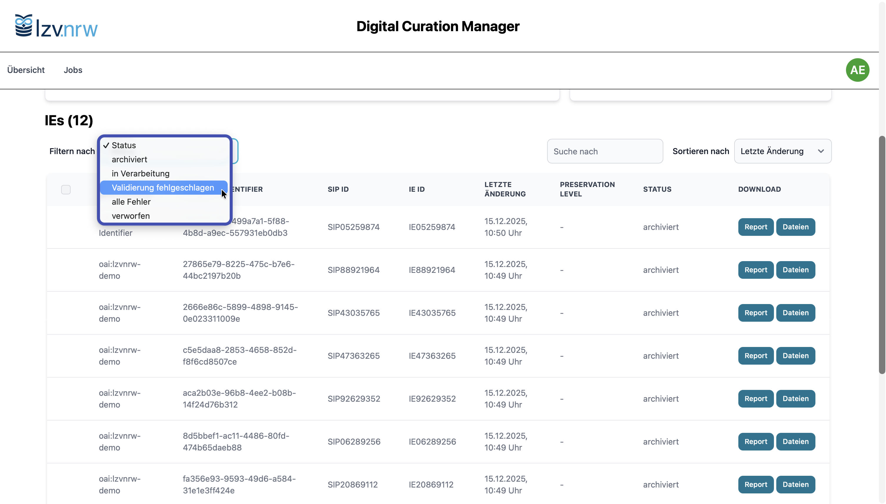{ .image-frame }

    Über den Filter *Validierung fehlgeschlagen* lässt sich die Darstellung auf alle fehlerbehafteten IEs einschränken.

-   **Reports und Verarbeitungsstufen prüfen**

    ---

    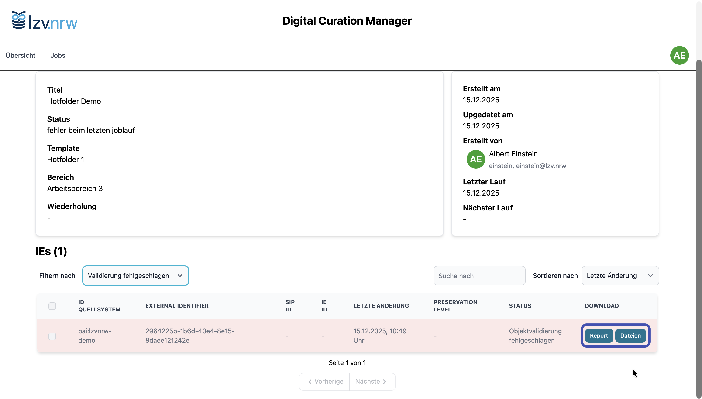{ .image-frame }

    Über den IE-Report lassen sich Details zur Fehlerursache einsehen; zur vertieften Analyse können die vorliegenden Verarbeitungsstufen heruntergeladen werden.

### Verarbeitung fehlerhafter IEs steuern

-   **Fehlerhafte IEs auswählen**

    ---

    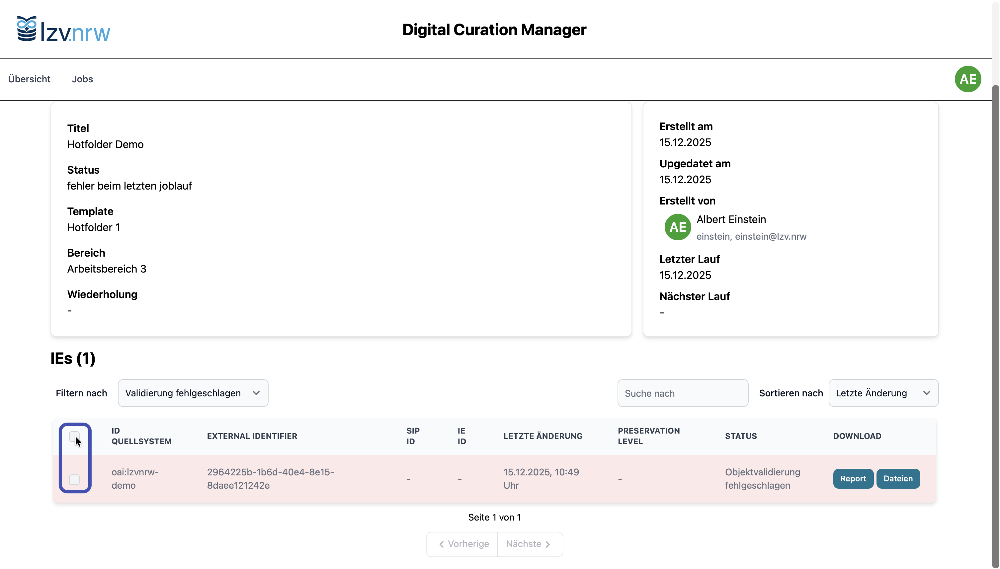{ .image-frame }

    Alle fehlerbehafteten IEs sind selektierbar, um die Bearbeitung fortzusetzen.

-   **Aktionen für fehlerhafte IEs aufrufen**

    ---

    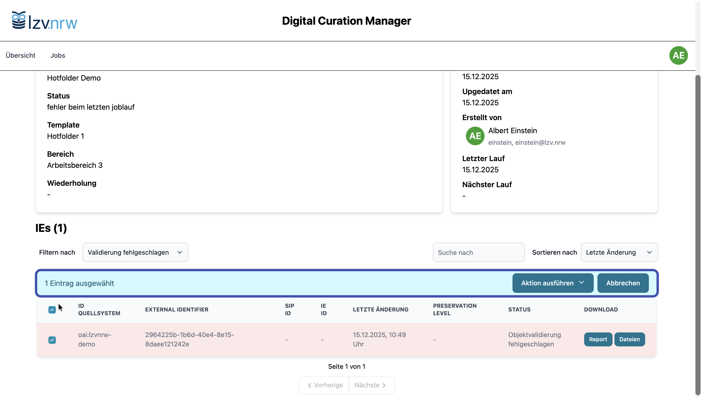{ .image-frame }

    Nach Selektion einer oder mehrerer IEs erscheint ein zusätzliches Aktionsmenü oberhalb der Tabelle.

-   **Aktion auswählen**

    ---

    { .image-frame }

    Über das Aktionsmenü stehen drei Optionen zur Weiterverarbeitung fehlerhafter IEs zur Verfügung.

Die verfügbaren Aktionen ermöglichen es, gezielt auf Validierungsfehler zu reagieren. 
Welche Option sinnvoll ist, hängt von Art und Ursache des Fehlers sowie von den fachlichen Anforderungen an die Archivierung ab. Im Folgenden werden die einzelnen Aktionen näher erläutert.

### Aktionen bei Validierungsfehlern

Bei fehlgeschlagener Objektvalidierung stehen drei Aktionen zur Verfügung, mit denen Sie das weitere Vorgehen für die betroffene Intellectual Entity festlegen können.

#### Fehler ignorieren

Mit dieser Aktion wird die IE trotz Validierungsfehler für die weitere Verarbeitung freigegeben. 
Die verbleibenden Verarbeitungsschritte werden regulär ausgeführt, und die IE wird im nächsten Job-Lauf erneut verarbeitet und archiviert.

#### Als Bitstream archivieren

Mit dieser Aktion wird die IE trotz Format- oder Strukturfehlern in die Archivierung übernommen. 
Das optionale Metadatum *Preservation Level* wird automatisch auf *Bitstream* gesetzt.

Der folgende Ablauf zeigt exemplarisch, wie sich diese Aktion auf den Status der IE während der weiteren Verarbeitung auswirkt.

-   **Aktion auswählen**

    ---

    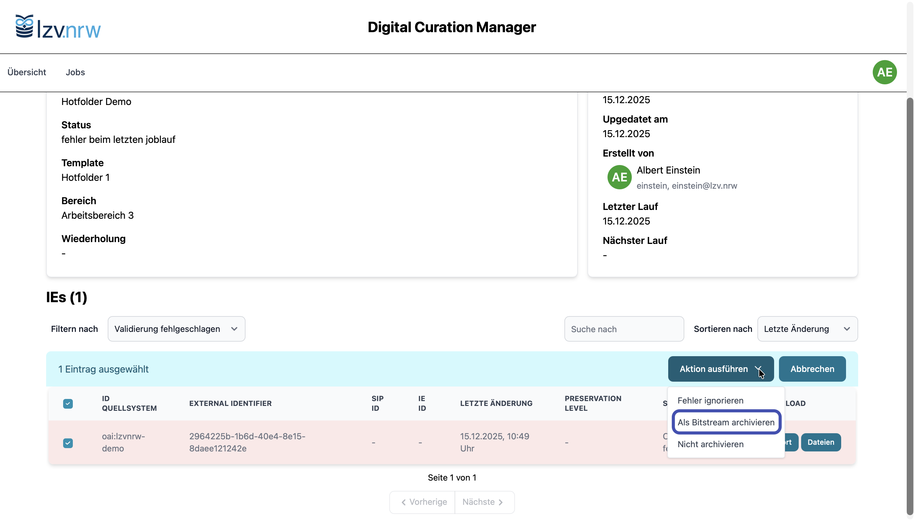{ .image-frame }

    Die Aktion *Als Bitstream archivieren* wird für eine fehlerhafte IE ausgewählt.

-   **Status: In Verarbeitung**

    ---

    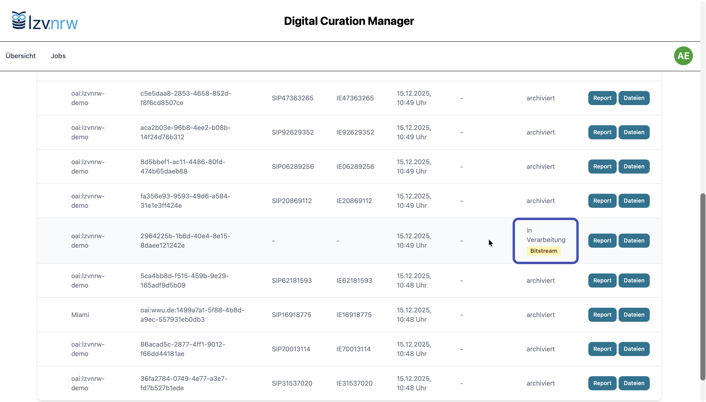{ .image-frame }

    Die IE wird bis zum nächsten Job-Lauf als *In Verarbeitung* geführt.

-   **Weiterverarbeitung im Job-Lauf**

    ---

    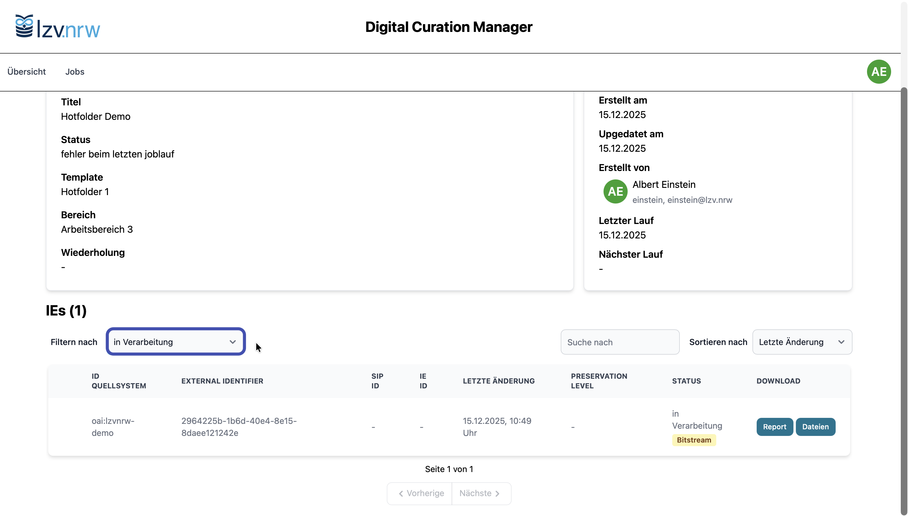{ .image-frame }

    Auch hier kann ein entspechender Filter eingesetzt werden. Im nächsten Job-Lauf wird die IE erneut verarbeitet.

-   **Archivierung als Bitstream**

    ---

    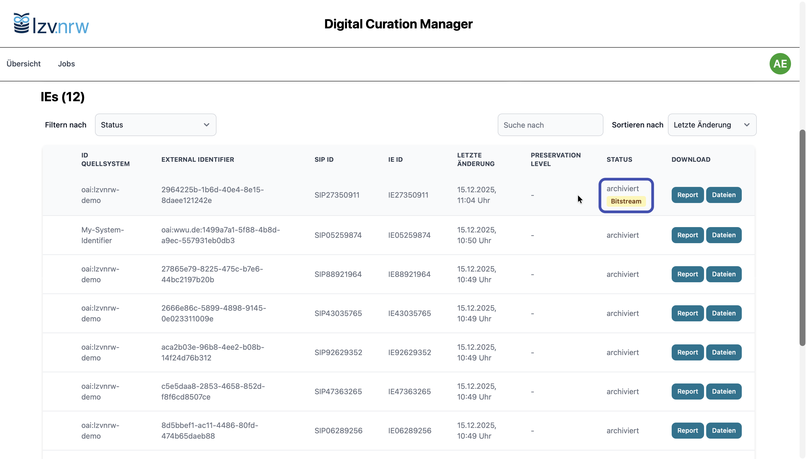{ .image-frame }

    Die IE wurde erfolgreich als Bitstream archiviert.

!!! info "Abhängigkeit vom Zielsystem"

    Ob eine IE nach der Auswahl von *Fehler ignorieren* oder *Als Bitstream archivieren* tatsächlich erfolgreich archiviert werden kann, hängt von den Validierungs- und Ingest-Regeln des angebundenen Langzeitarchivierungssystems ab.
    
    Je nach Systemkonfiguration können fehlerhafte Objekte dort erneut validiert und gegebenenfalls abgelehnt werden, auch wenn sie im DCM zur Weiterverarbeitung freigegeben wurden.

#### Nicht archivieren

Mit dieser Aktion wird die fehlerhafte IE aus der weiteren Verarbeitung ausgeschlossen und als nicht archivierungsfähig markiert. 
Updates im Quellsystem oder das Bereitstellen eines aktualisierten IPs per Hotfolder werden erkannt, sodass die IE in einem späteren Job-Lauf erneut automatisch verarbeitet werden kann.
